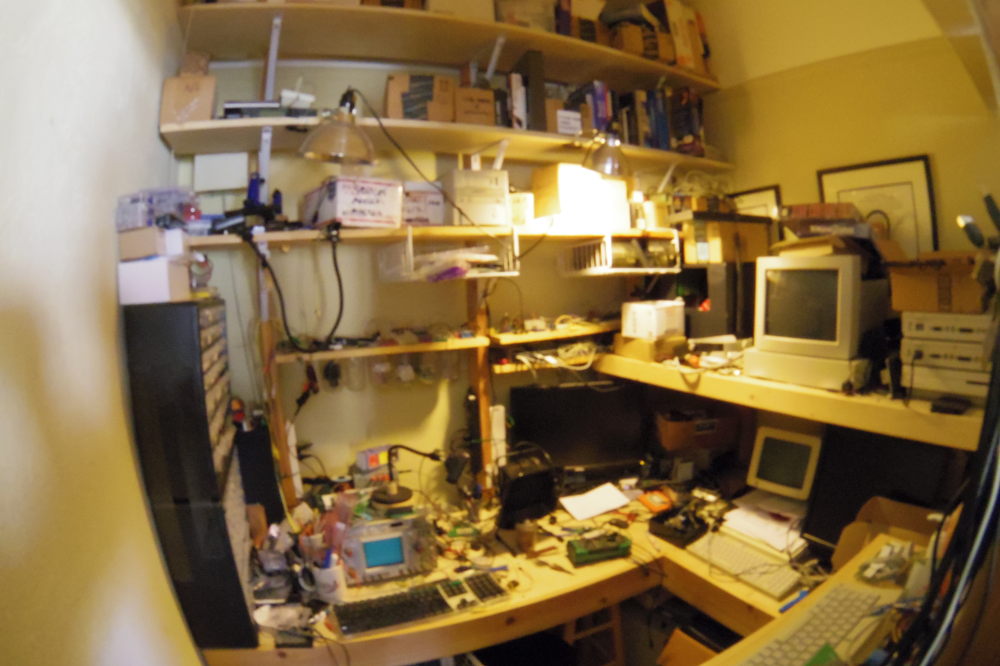
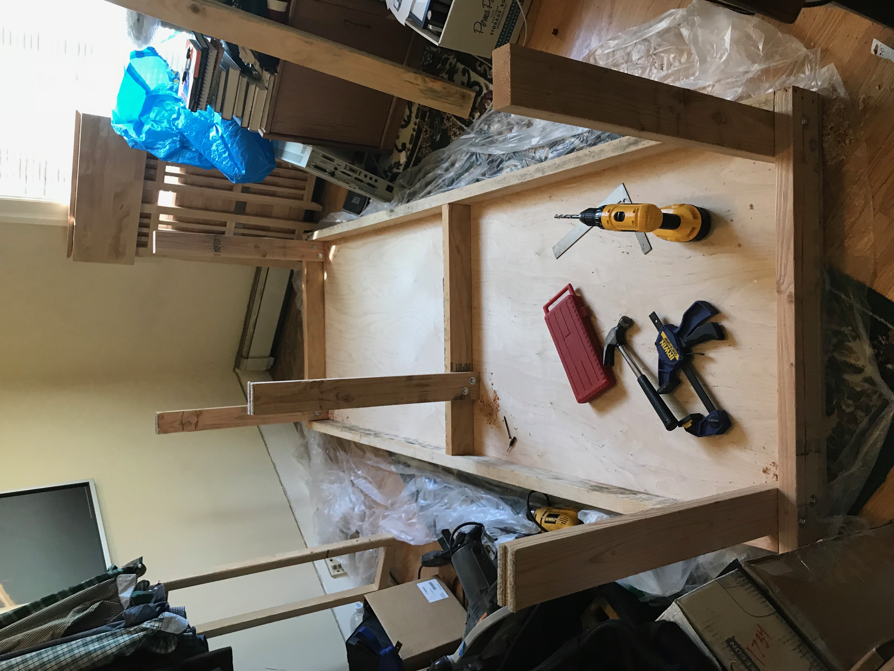
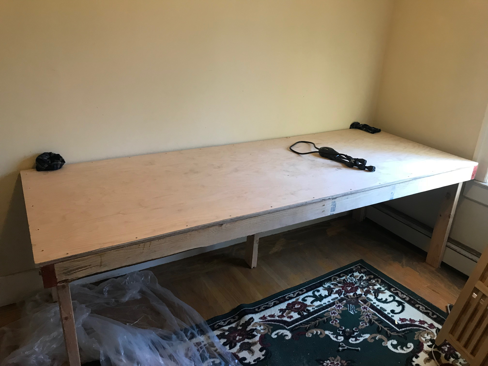
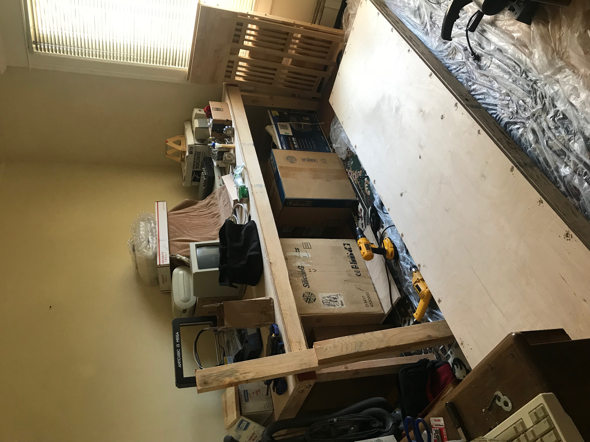
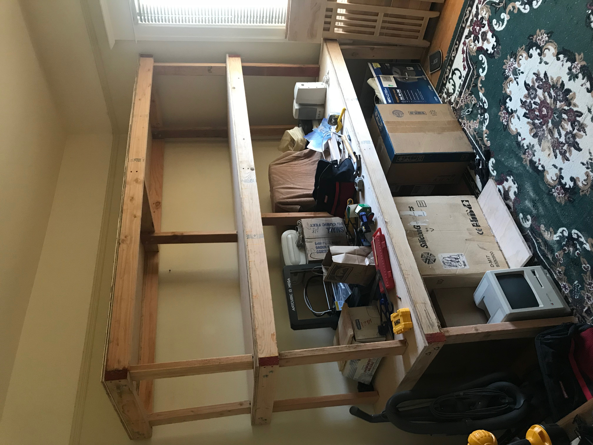
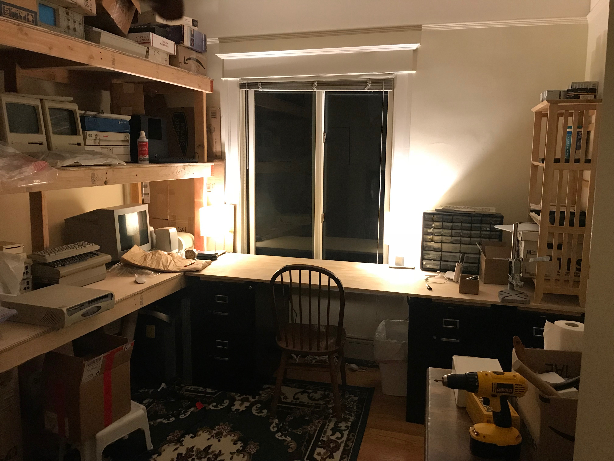

I enjoy collecting (and sometimes restoring) old tech.

During the spring of 2020, I decided to build a new set of shelves and move this gear out of the cramped 8x5 alcove where I had kept it for the previous ~5 years.

### The new setup:

### The old setup :
(sorry for the fisheye perspective, but the alcove is too small)

### The build:

