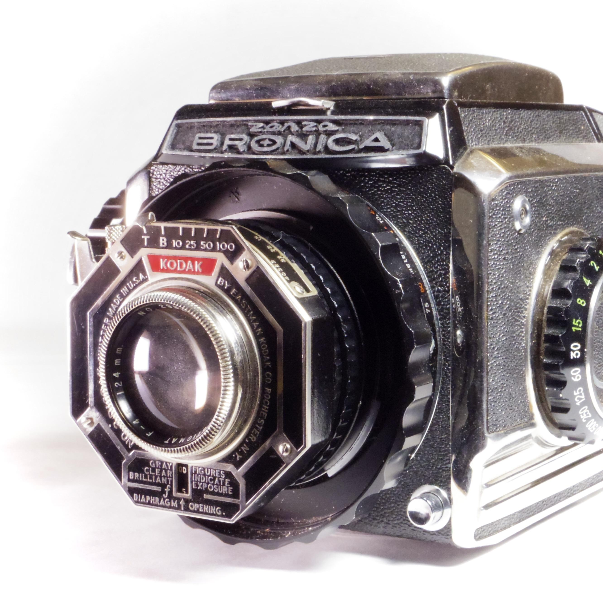
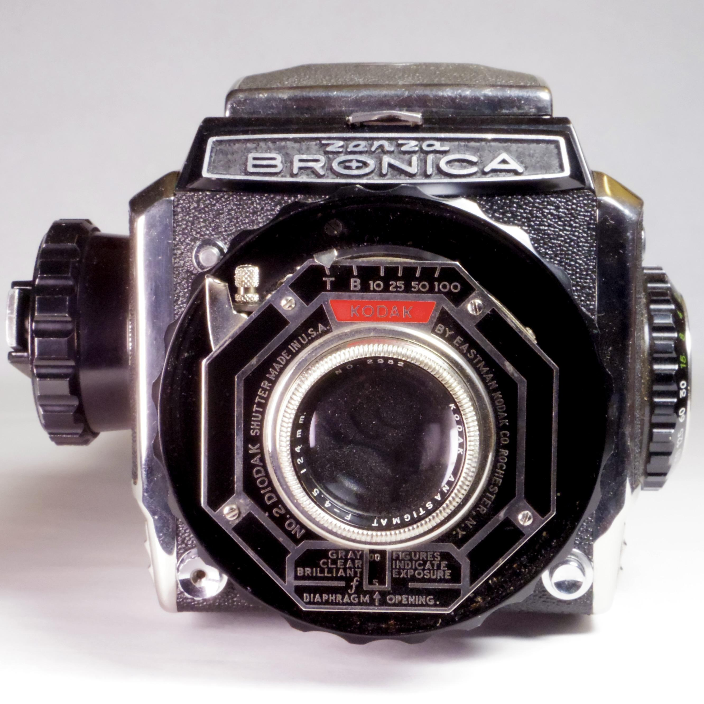
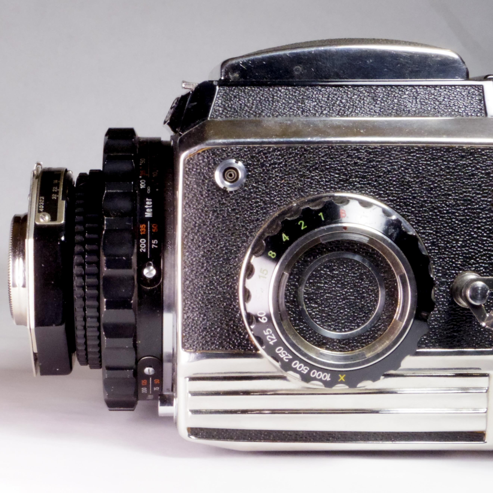
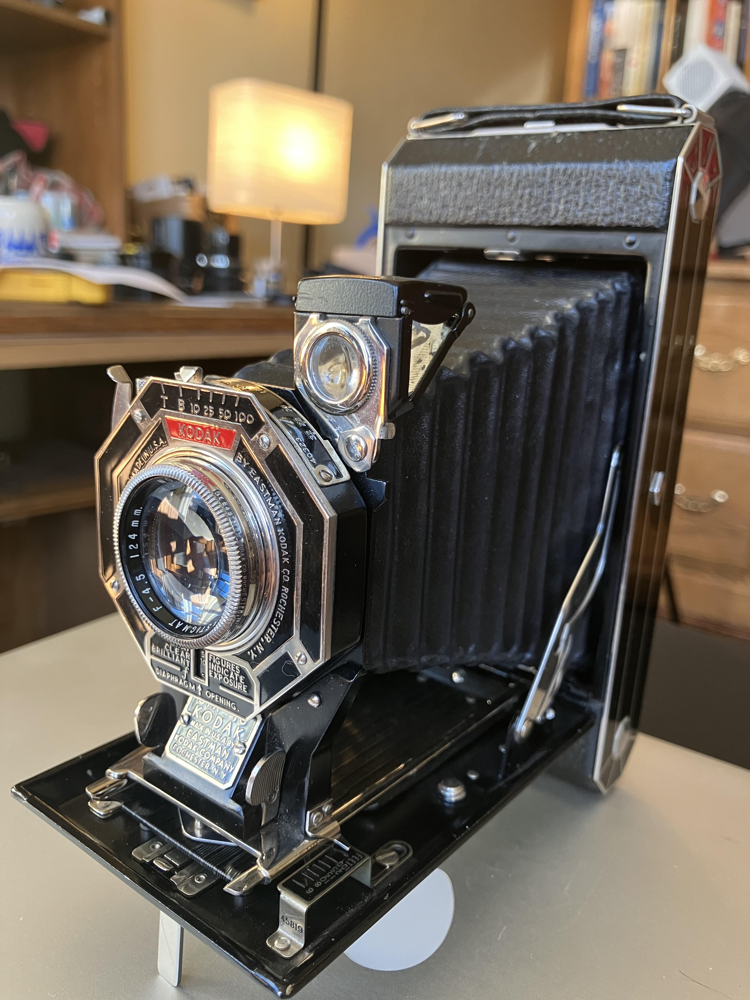
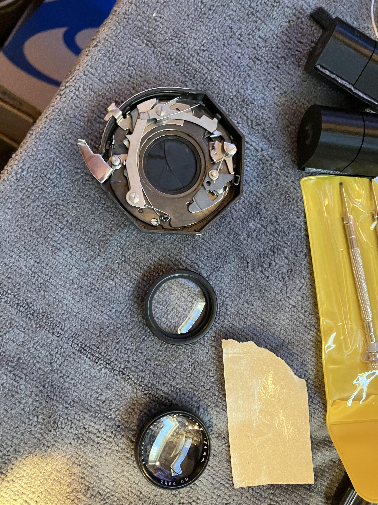
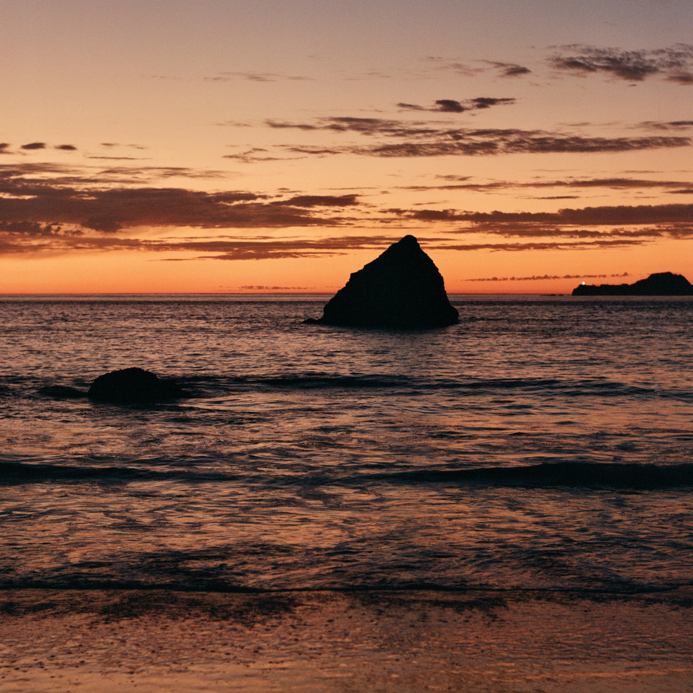
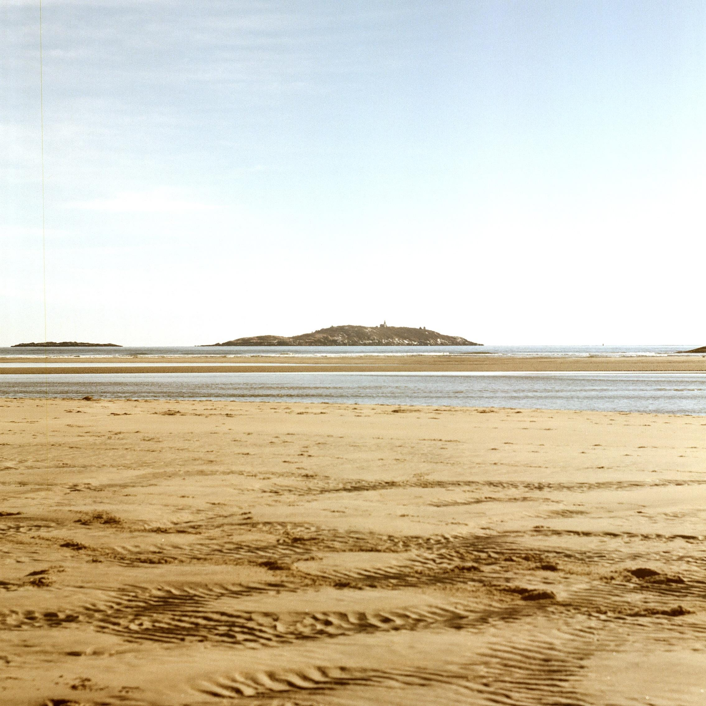
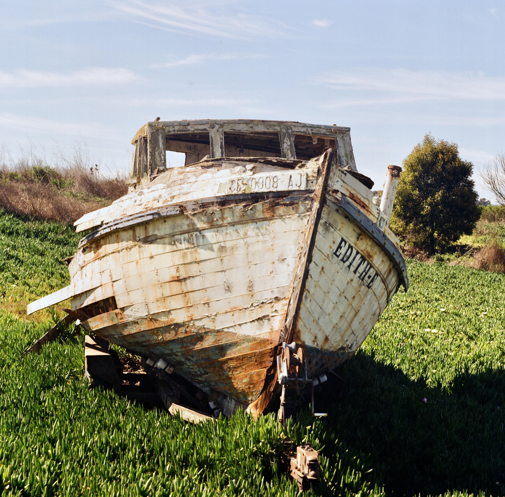
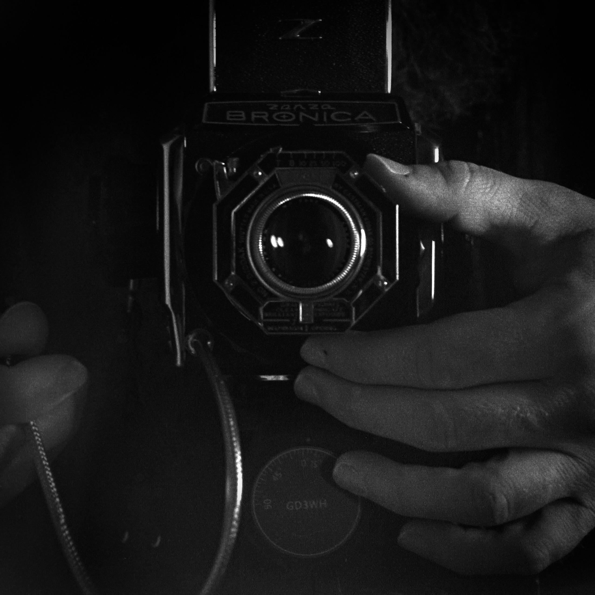

# Basic review

This lens performs very well, rendering images I consider to be "good enough" (in contrast to "shitty in a shit way" and "shitty in a cool way", my other two lens ratings).  Many of these early Kodaks came with a variety of different shutter and lens combinations.  Given the wide aperture of f4.5 (for the time), I suspect this was one of the more premium lenses.  It's not a triplet design; I suspect it to be a tessar or related design based on disassembling it for cleaning.  I'd actually be much more interested in trying a triplet version of this lens, if I can find one, since I suspect that will have the potential for some swirl under the right conditions.  Tessars are very swirl resistant.

While the lens is optically decent, it does have a few other things going for it.

*First, it looks awesome.*

Second, it's not entirely a pain in the ass to use.  The lens has a T mode, which makes holding it open simple.  The aperture is adjusted by rotating the inner, knurled ring around the lens, and after cleaning, it moves reasonably smoothly.  The lens does not have front-cell focusing, so the original Bronica helicoid is used for focusing.

Third, it's quite small, easily a pancake.  It takes virtually no space in a bag, and so there's little barrier to bringing it along as a fun second lens.  The closest system lenses are the Zenzanon 100mm f2.8 (also a pancake when mounted but 3-4 times the size in your bag), and the Nikkor-Q 135mm f3.5, which is only marginally faster and like 8 times the size.

Finally, the cost.  While the Nikkor Q is pretty as cheap as medium format lenses go, with some patience, you can get a Six-16 for almost nothing, especially if the bellows are shot.  On the other hand, if you get a working one, shooting 120 film in it is trivial with 3d printed spool adapters, and it gives you a nice wide nearly 6x11 frame.  Buying the adapter hardware is probably the most expensive part of this project.

On the downside...

The lens is somewhat delicate and I hate having it loose in my bag.  I've thought about 3d printing a case for it, but haven't gotten to that yet.

But perhaps the worst thing....

Despite being a pancake-ish, great looking, portrait focal-length, leaf shutter lens that adapts cleanly and reversibly to your Bronica, this lens lacks the feature that most would want when adapting a leaf shutter lens:  flash sync.

To my knowledge, there is no sync port on this lens assembly.  Of course, it's probably relatively straight forward to modify it to have one, but that's an independent project, and not something likely to be easily reversible.  Maybe another day.

Despite that, the leaf shutter is perfectly useable, even if a bit clunky procedurally:

- Focus with the lens wide open, shutter open in T mode.

- Make sure film is advanced

- Close shutter with T-mode

- Set Kodak shutter to desired time

- Set Bronica FPS to B mode

- Hold down cable release or lock it to open Bronica FPS.

- Fire the Kodak shutter

- Release cable release to Bronica, closing the FPS

- Wind Bronica

- Set Kodak back to T-mode and open the shutter

The shutter is a Kodak Diodak No. 2.

# Why this lens

Although this lens looks fucking awesome, I choose it much more for technical reasons....  I wanted a very compact portrait-length lens.

The flange distance (from the film plane to where the lens mounts) on a Bronica S2 series camera is 101.7mm (with the helicoid).

For simple leaf shutter lenses from folding cameras, there are a two relevant rules of thumb:

- for infinity focus, the distance from the center of the lens to the film plane should be about the focal length

- the lens focal length is going to be approximately equal to the diagonal of the film format

With this information, I knew I was targeting a lens just a little longer than the ~102mm flange distance (since our first rule measures from the center of the lens, but we want the lens to stick out past the adapter, not need to sit half-recesssed).

I first tried a 110mm lens from a 120 folder, but it couldn't achieve infinity focus without recessing.  So I needed something longer than you'd find on most 120 format cameras.

To get a lens about 120mm, I needed a film format that was close to having that as its diagonal measurement.  616 comes pretty close, at 63.5 x 108mm or a diagonal of about 125mm.

Knowing that I needed a 616 folder, I pretty quickly narrowed in on this one, probably thanks to having watched [Simon's Utak video on art deco cameras featuring the very similarly styled Kodak Six-20](https://youtu.be/Ey6k7Wq2bII?si=qQxCzJrAGnaTqK3l&t=822).

# Adapting it

I wanted to make this a non-destructive process.  Since I had to remove the lens from the Kodak Six-16 anyways (it was filthy, and both the aperture and shutter were jammed), this was straight forward.

The lens is held in with a circular retaining ring, easily unscrewed from the inside with the camera's back open.

I then found some suitable adapter rings big enough to fit around the Kodak's thread, and attached them to a [RAF camera M42 -> M57 adapter](https://rafcamera.com/adapter-m42x1f-to-m57x1m?srsltid=AfmBOoq78J1EOd1VKHryFxyDhGn6UcqJUqntUkpQoLogsfuAxAljybIV) which screws easily onto the bronica.

If you enjoyed this, check out the posts of:

- [u/acoillet](https://old.reddit.com/u/acoillet) [here](https://www.reddit.com/user/acoillet/submitted/) for S2 Nikkor telephotos

- [u/Someguywhomakething](https://old.reddit.com/u/Someguywhomakething)'s work on [adapting a Samyang 24mm TiltShift lens](https://www.reddit.com/r/AnalogCommunity/comments/1qczpe0/re_samyang_24mm_ts_on_bronica_s2a/)

- [Shawn on adapting a Ivanichek Petzvar lens to Bronica](https://rangefinderforum.com/threads/ivanichek-petzvar-120mm-to-bronica-conversion.4816041/)

