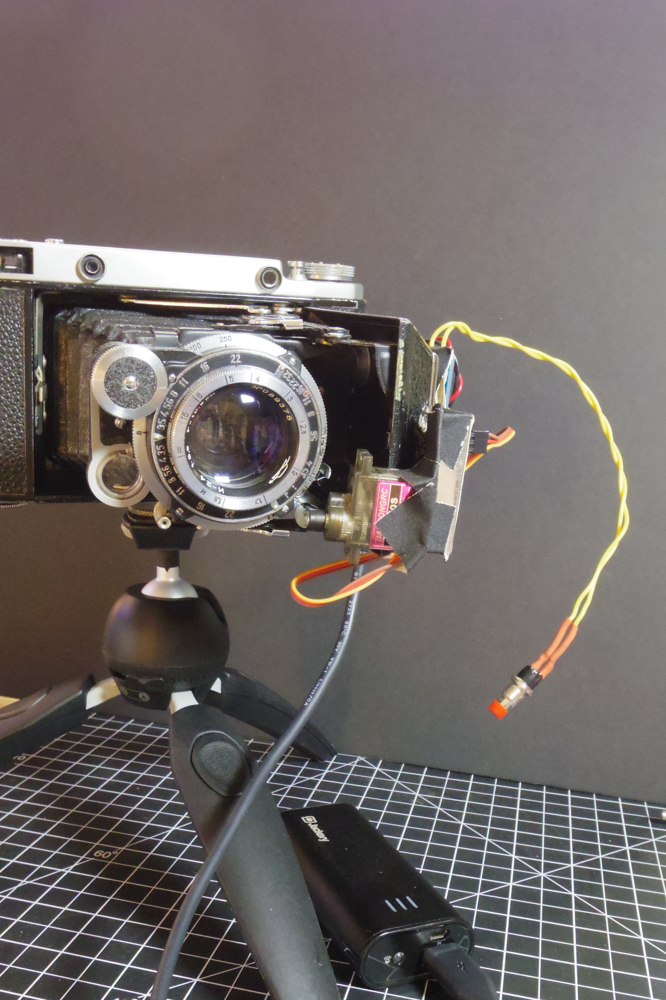
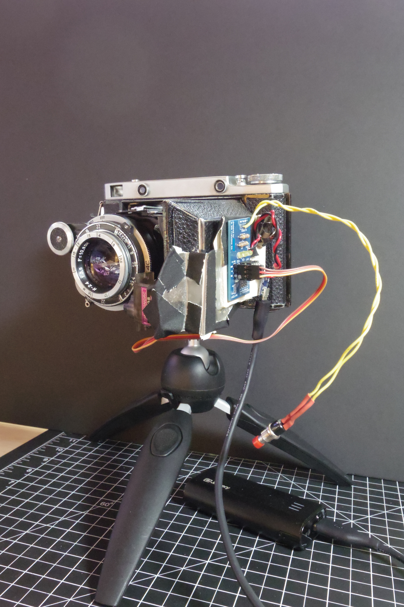
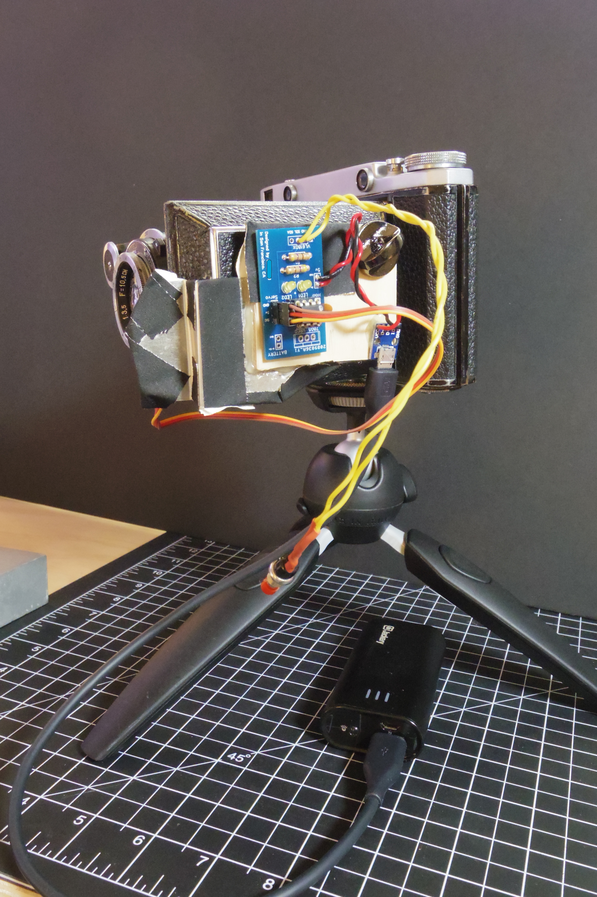

Powered by a standard usb powerbank, works just like a cable release for my Moskva5.  Built in under 2 hours for a night photowalk (though I heavily recycled parts from a [previous project](/posts/autochopsticks)).

<blockquote class="imgur-embed-pub" lang="en" data-id="qW72i9v"><a href="https://imgur.com/qW72i9v">View post on imgur.com</a></blockquote>

<blockquote class="imgur-embed-pub" lang="en" data-id="7CR61P2"><a href="https://imgur.com/7CR61P2">View post on imgur.com</a></blockquote>

Code on [github](https://github.com/brianssparetime/arduknips).