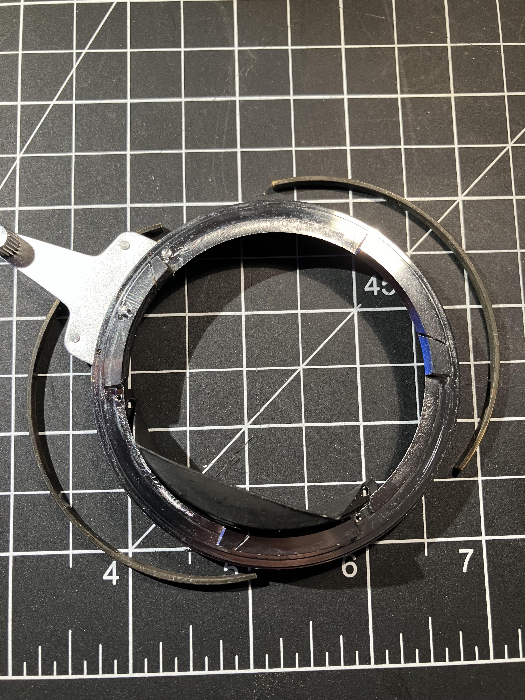
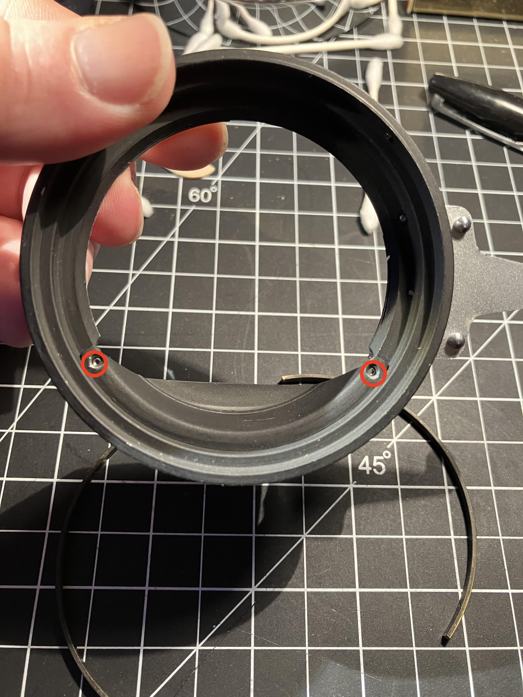
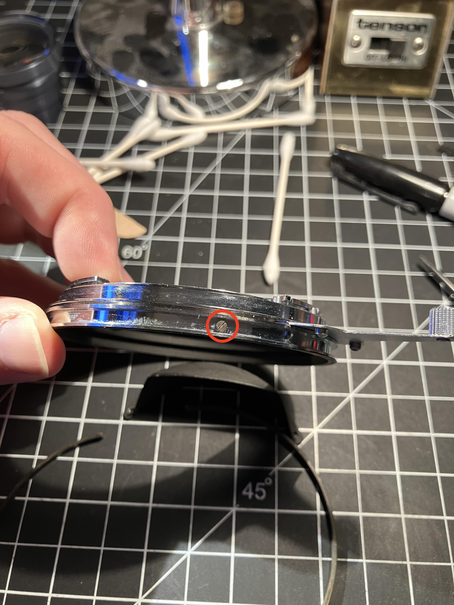
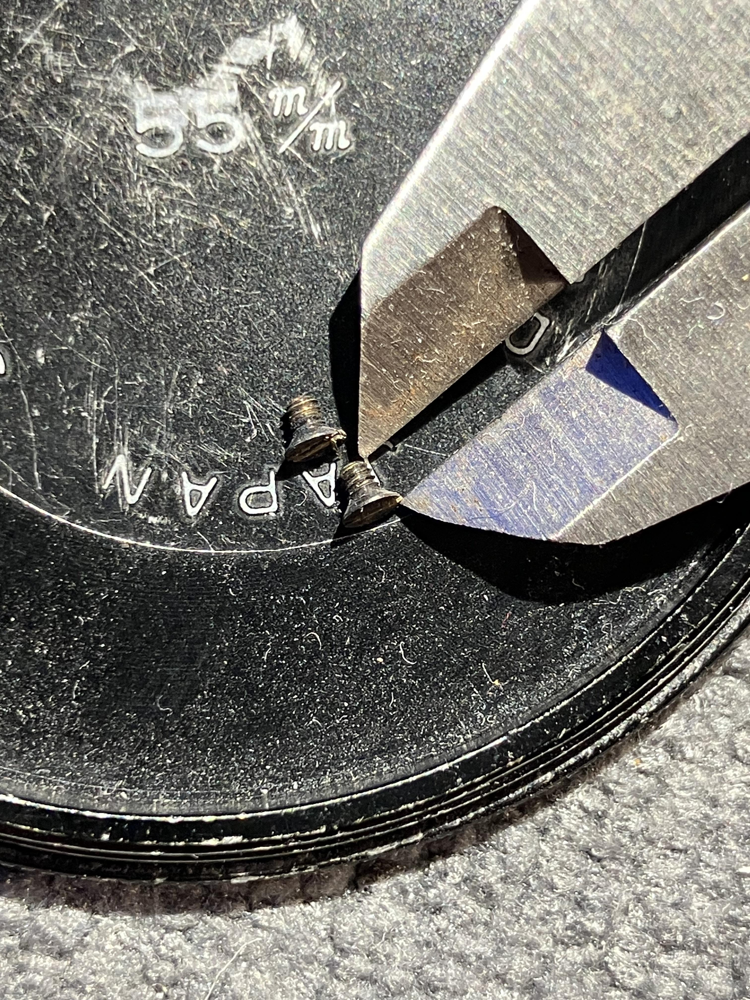
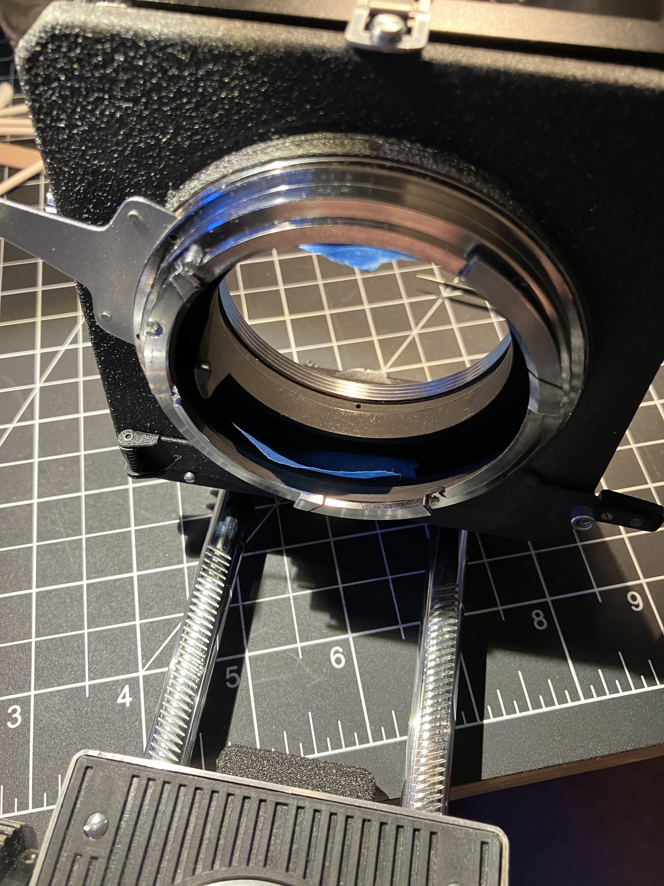
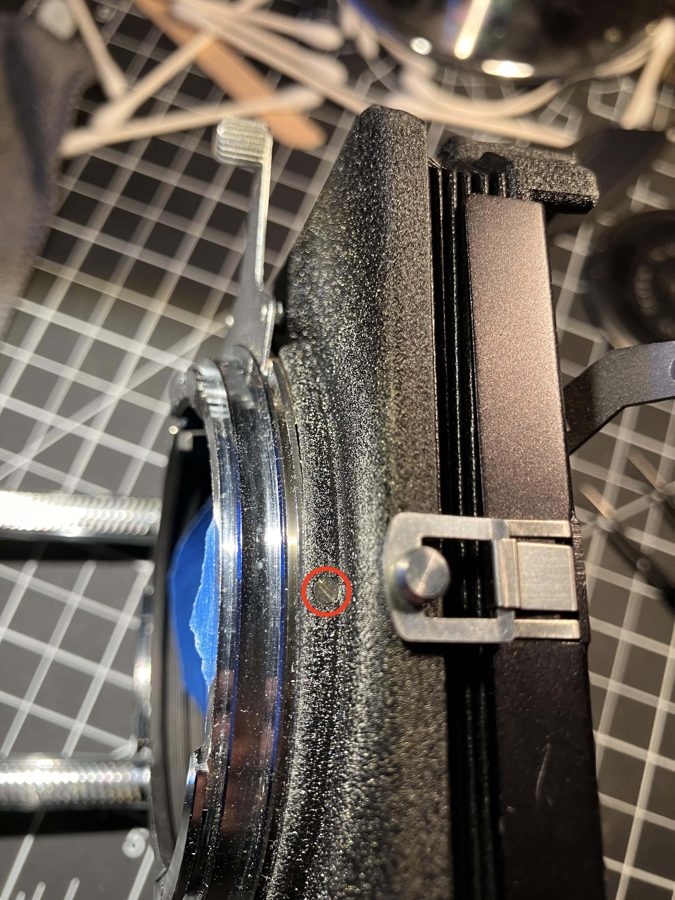
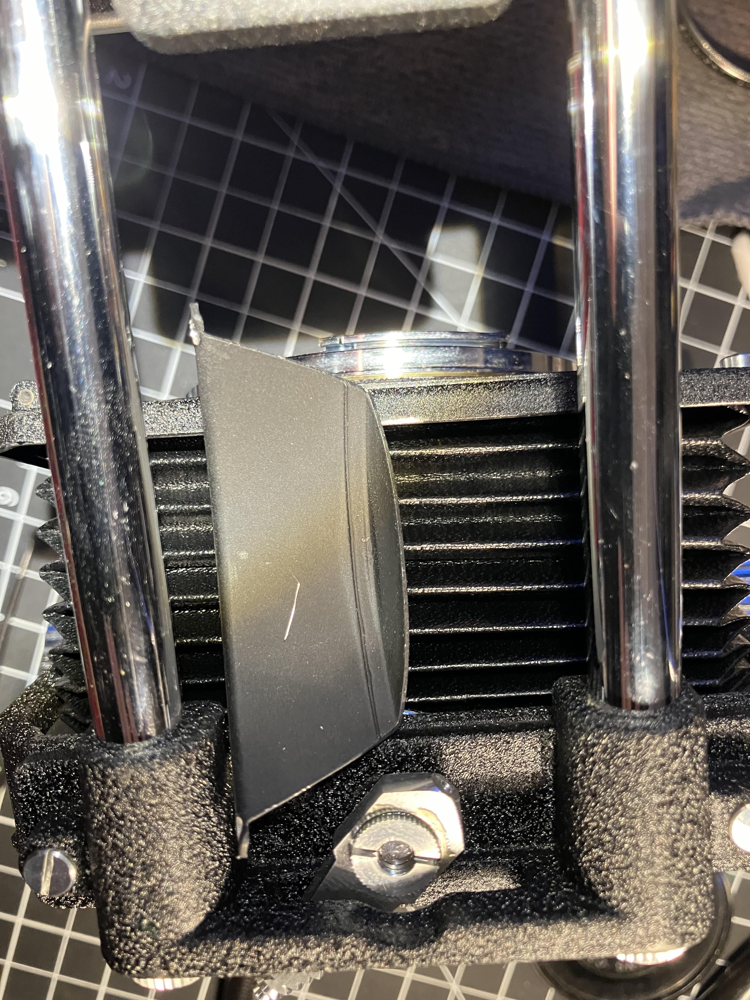
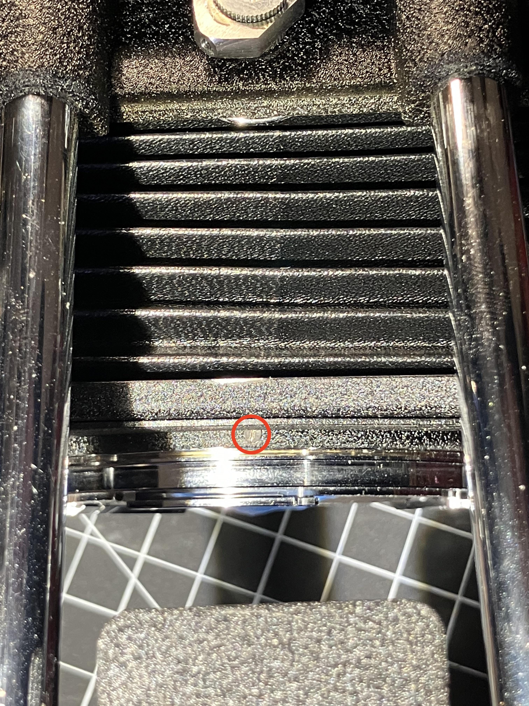
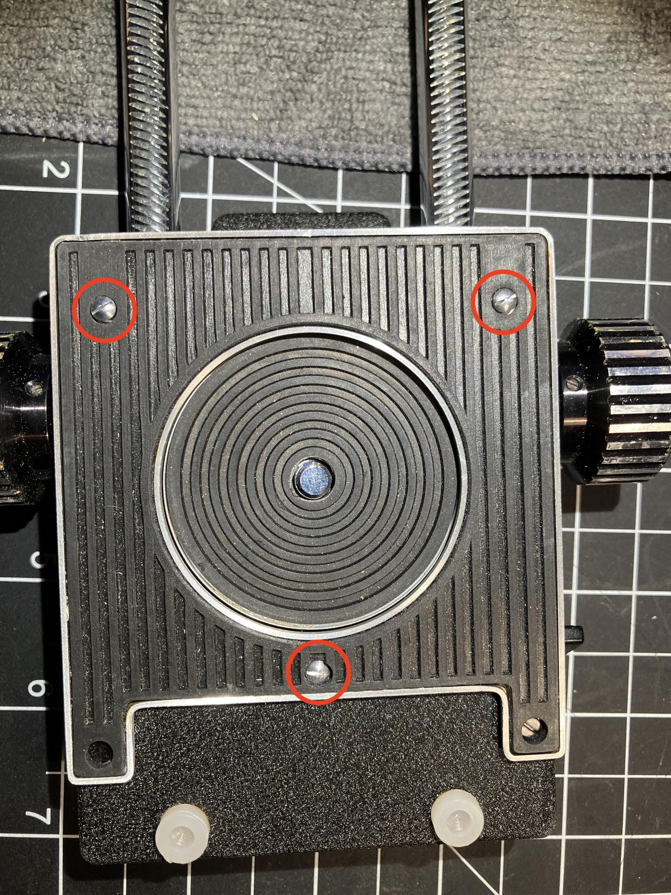

So I've enjoyed shooting macro with my S2 and the bellows I have for it ([example](https://www.flickr.com/photos/brianssparetime/53937499798/in/album-72177720318404452) with a Tessar 50mm f2.8 and with the TT Artisans 100mm f2.8 triplet [1](https://www.flickr.com/photos/brianssparetime/53971668217/in/album-72177720318404452) and [2](https://www.flickr.com/photos/brianssparetime/53936345512/in/album-72177720318404452)).

But last time I got it out, I noticed that the mount to the S2 body on the back plate of the bellows was loose.  While trying to unlock it from the body, a piece fell out, causing the mount ring to slide out of plane with the back standard of the bellows.

Note:  everything here is about the bellows Type 2, the one that replaces the helicoid and has movements, not the smaller Type 1 that attaches to the helicoid and only extends.

**Repairing the bellows**

That back part of the bellows comprises primarily four parts:  the back standard, the mount ring, and two brass thin metal strips that fit into grooves on the mount ring forming a partial ring.  

Additionally, four screws (top, bottom, left, and right) screw into the brass strips, but not through them into the mount ring.  Oriented with the bayonet lever at about 10:30 on the clock, with the camera-side of the ring facing upwards, the groove at the base of the mount ring where these two strips slide has a small stud screw sticking out of it, maybe at 11 or 11:30. Only of the two brass strips has a screw hole close enough to the end, that when fitted up against this stud, the screw hole is facing north or towards 12:00.  This strip is also the shorter of the two.

Once I had my replacement screws (more on that in a minute), I put some painters tape inside the bellows so the mount ring wouldn't drop down through the back standard, and lowered in the mount ring.  The lever should align so that it's stops are on either side of the single peg sticking out from the back standard.  Then, carefully screw in the screws.  These things are microscopic, so be sure to work on a towel or something so you can catch them if they fly off.  In the image showing the caliper with the screw, the caliper is set to 2mm.

**S2 and EC conversion**

Around the time the bellows broke, I came across an EC-TL at a good price.  

Of the two systems, the EC-TL is better suited to the bellows because of its built-in metering.  Having to guess at bellow extension compensation factors sucks.

The manual and everything you read online says that the two bellows are incompatible.  But looking closely, at photos of the EC bellows, I see only two differences:

1)  The S2 bellows has a tongue that sticks out from the mount ring into the camera body.  It's painted black and I presume is meant to prevent bellows-mounted lenses from hitting the back mirror.  Unfortunately, I think the tongue itself would hit the mirror in the EC series.

You need to remove two tiny screws, one on each side, that attach the tongue to the mount ring, and face into the bellows.  This is simple if you have the mount ring already removed; otherwise, you can probably reach in through the collapsed bellows from the front.

*These two screws that hold in the tongue are exactly the same size and thread as the four screws that hold the base ring into the back standard via the two brass strips.*

Remember, you no longer have a backstop preventing anything from hitting the mirror.  You can't get replacement mirror parts these days, so don't stick anything in the bellows that goes far enough back to be a problem.  

Removing the tongue should allow the bellows to work with either the S2 or EC series.

2)  The second difference between the two bellows is that the EC bellows has a set of three pins that protrude from the baseplate where it screws to the underside of the camera body.  These pins force alignment of the camera body's axis with the rails.  

On the S2 bellows only the single screw into the tripod socket attaches the baseplate, so it's possible to unintentionally have some what is effectively back standard movement if you don't get the rails screws on straight.

While S2 bellows lacks these alignment pins (and the body lacks the corresponding holes), the S2 bellows does seem to have screw holes in approximately the same place.  One could probably exchange the screws for studs of the correct size if one wanted to have the alignment option with an EC, but I want to be able to go back and forth, so I won't be doing this.

I don't believe there are any additional functional differences, but someone correct me if I'm wrong.

So I've enjoyed shooting macro with my S2 and the bellows I have for it ([example](https://www.flickr.com/photos/brianssparetime/53937499798/in/album-72177720318404452) with a Tessar 50mm f2.8 and with the TT Artisans 100mm f2.8 triplet [1](https://www.flickr.com/photos/brianssparetime/53971668217/in/album-72177720318404452) and [2](https://www.flickr.com/photos/brianssparetime/53936345512/in/album-72177720318404452)).

But last time I got it out, I noticed that the mount to the S2 body on the back plate of the bellows was loose.  While trying to unlock it from the body, a piece fell out, causing the mount ring to slide out of plane with the back standard of the bellows.

Note:  everything here is about the bellows Type 2, the one that replaces the helicoid and has movements, not the smaller Type 1 that attaches to the helicoid and only extends.

**Repairing the bellows**

That back part of the bellows comprises primarily four parts:  the back standard, the mount ring, and two brass thin metal strips that fit into grooves on the mount ring forming a partial ring.  

Additionally, four screws (top, bottom, left, and right) screw into the brass strips, but not through them into the mount ring.  Oriented with the bayonet lever at about 10:30 on the clock, with the camera-side of the ring facing upwards, the groove at the base of the mount ring where these two strips slide has a small stud screw sticking out of it, maybe at 11 or 11:30. Only of the two brass strips has a screw hole close enough to the end, that when fitted up against this stud, the screw hole is facing north or towards 12:00.  This strip is also the shorter of the two.

Once I had my replacement screws (more on that in a minute), I put some painters tape inside the bellows so the mount ring wouldn't drop down through the back standard, and lowered in the mount ring.  The lever should align so that it's stops are on either side of the single peg sticking out from the back standard.  Then, carefully screw in the screws.  These things are microscopic, so be sure to work on a towel or something so you can catch them if they fly off.  In the image showing the caliper with the screw, the caliper is set to 2mm.

**S2 and EC conversion**

Around the time the bellows broke, I came across an EC-TL at a good price.  

Of the two systems, the EC-TL is better suited to the bellows because of its built-in metering.  Having to guess at bellow extension compensation factors sucks.

The manual and everything you read online says that the two bellows are incompatible.  But looking closely, at photos of the EC bellows, I see only two differences:

1)  The S2 bellows has a tongue that sticks out from the mount ring into the camera body.  It's painted black and I presume is meant to prevent bellows-mounted lenses from hitting the back mirror.  Unfortunately, I think the tongue itself would hit the mirror in the EC series.

You need to remove two tiny screws, one on each side, that attach the tongue to the mount ring, and face into the bellows.  This is simple if you have the mount ring already removed; otherwise, you can probably reach in through the collapsed bellows from the front.

*These two screws that hold in the tongue are exactly the same size and thread as the four screws that hold the base ring into the back standard via the two brass strips.*

Remember, you no longer have a backstop preventing anything from hitting the mirror.  You can't get replacement mirror parts these days, so don't stick anything in the bellows that goes far enough back to be a problem.  

Removing the tongue should allow the bellows to work with either the S2 or EC series.

2)  The second difference between the two bellows is that the EC bellows has a set of three pins that protrude from the baseplate where it screws to the underside of the camera body.  These pins force alignment of the camera body's axis with the rails.  

On the S2 bellows only the single screw into the tripod socket attaches the baseplate, so it's possible to unintentionally have some what is effectively back standard movement if you don't get the rails screws on straight.

While S2 bellows lacks these alignment pins (and the body lacks the corresponding holes), the S2 bellows does seem to have screw holes in approximately the same place.  One could probably exchange the screws for studs of the correct size if one wanted to have the alignment option with an EC, but I want to be able to go back and forth, so I won't be doing this.

I don't believe there are any additional functional differences, but someone correct me if I'm wrong.

