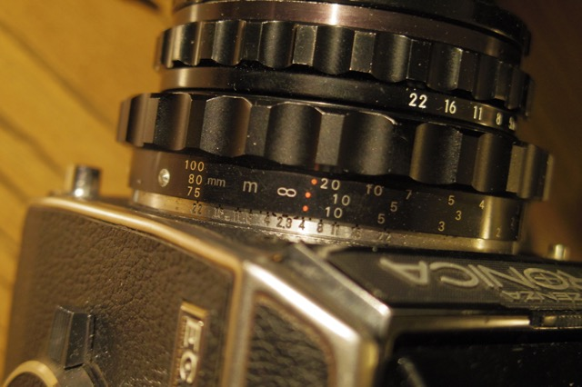

The Bronica S2 series uses a helicoid separate from the camera.  The focusing scale is a thin metal strip, secured to the helicoid with three tiny screws.

The stock scale can combine up to four focal lengths on one strip, but there are only a few variations of it, and it sucks for you if the lenses you use most don't appear on them.

So I wrote a tool to make my own.

You pick one to three focal lengths and your units (feet or meters), and it generates a strip with those scales, sized to be a perfect replacement for the stock one.

For printing to paper, there's a PDF output.  I've found that paper glued to a brass strip and sealed with a sealer spray works pretty well.  If you'd rather go for an engraved metal one, there's DXF output too, with the outline and slots on a `CUT` layer and the dots and text on an `ENGRAVE` layer.

The PDF includes a 1 cm and a 1 inch reference line.  Print at 100%, not the default fit-to-page, and check them with a ruler before you trust the strip.

The scales generated match the stock ones, as well as the additional scales provided in the S2 and EC manuals.  Only the 45, 85, and 105mm scales are worked out by extrapolation.

There's also a debug mode that gives you a strip showing bare helicoid extension.

I've deployed it at [brianssparetime.pythonanywhere.com](https://brianssparetime.pythonanywhere.com/) so you can easily generate and download strips without any install, but you are also welcome to download the script and run it locally.

[Source code is here on github](https://github.com/brianssparetime/BronicaHelicoidScaleMaker)
