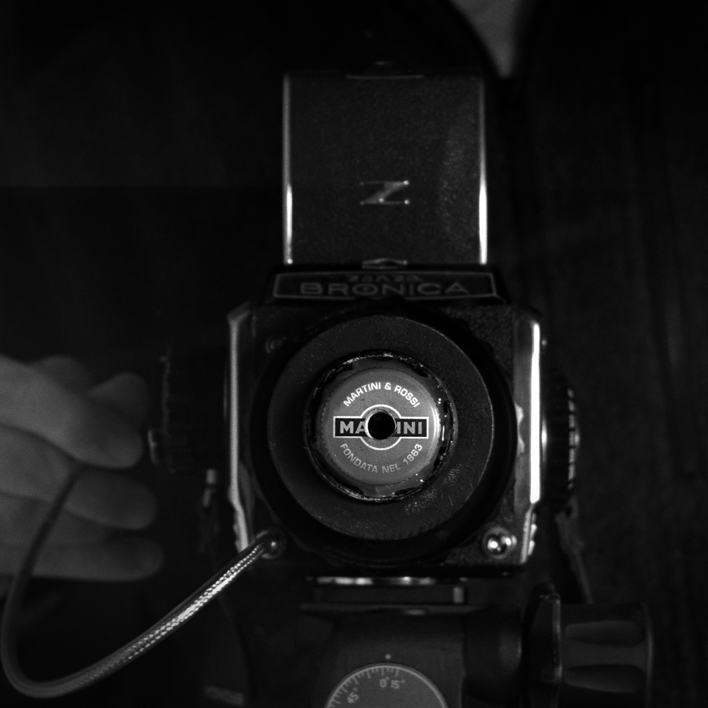
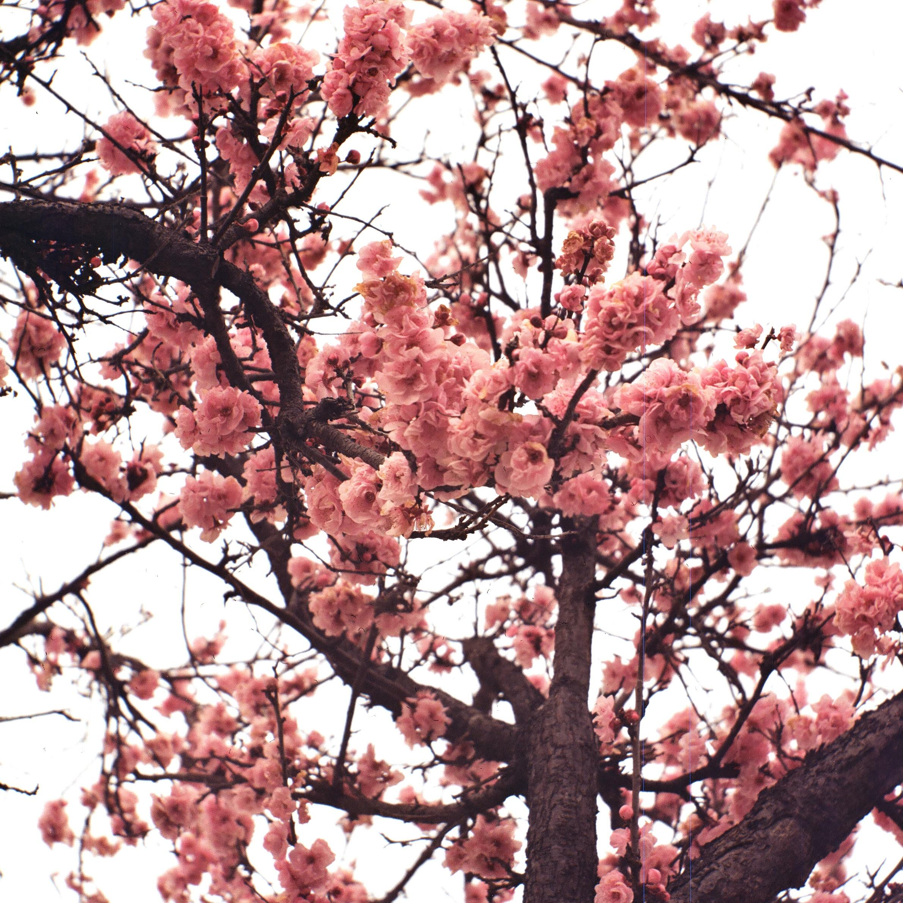
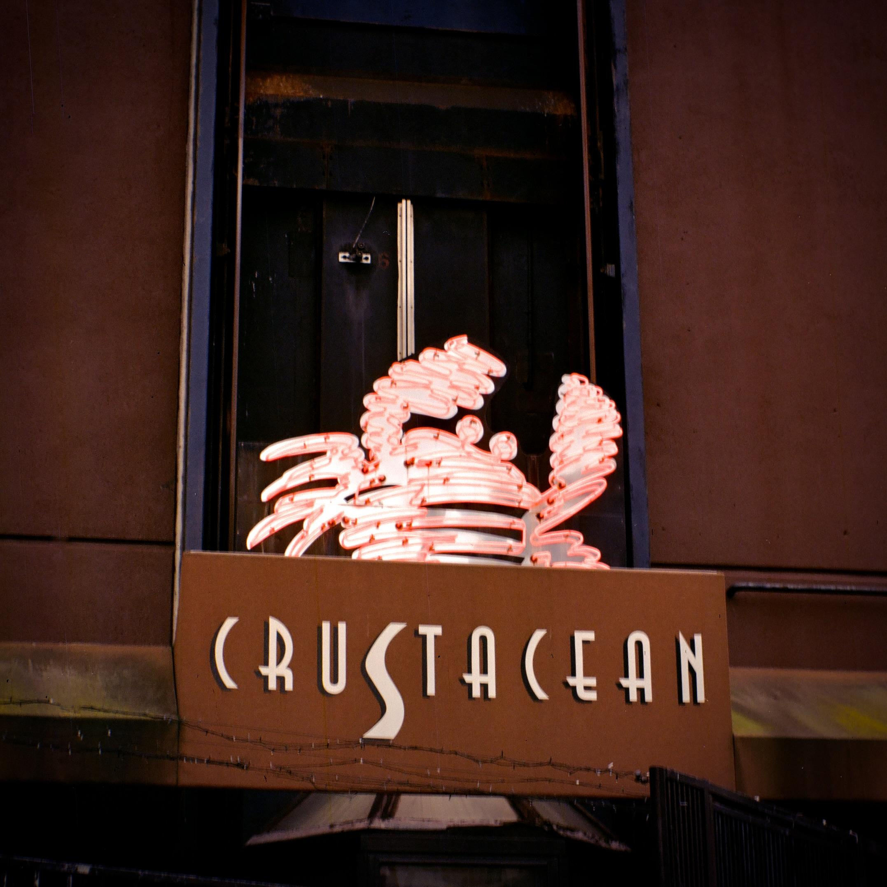
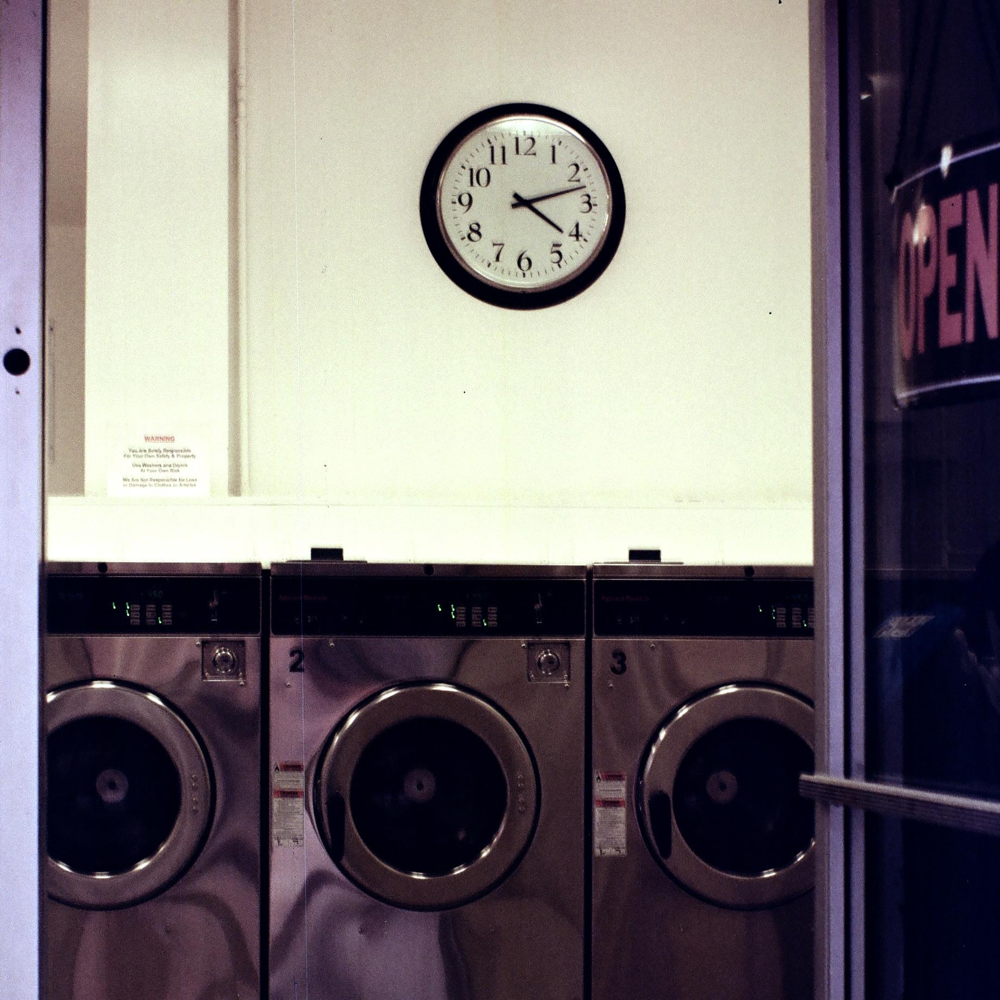

So my local camera store has a $5 bin that's mostly cracked glass and shitty box cameras.  I thought it might be fun to grab one and see what I could do with the lens.

I picked one a little bigger than a regular Brownie, and what I grabbed turned out to be a Buster Brown 2A, made from about 1916-1920.  The Buster Brown was Ansco's response to the Kodak Brownie, and it shot 116 film.

This last bit is why I chose it specifically.  116 film is 2 1/2" x 4 1/4", or about 65mm x 110mm nominal, with a diagonal of ~128mm.  A 6x9 camera has to cover a 90mm width (108mm diagonal) and often has a lens focal length around 105-110.  So a 116 camera covering a 128 diagonal ought to be in the sweet spot.

Because flange/registration distance also scales with focal length, a ~128mm lens ought to yield a roughly similar flange distance (at least for simple lenses like this).  The Bronica S2a has a flange distance of ~102mm to the end of the screw mount, and a M42 adapter consumes a few more mm. A small M42 helicoid occupies the remaining space.

To mount the lens, I cut out a small circle from $2 piece of thin 1/8" hobby/model plywood, painted it black, and super glued on M39-M42 adapter rings, one on each side.  I chose these because they were the cheapest thing I could buy with a male M42x1 thread - less than a dollar.  Finally, I drilled a center hole for the lens, drank a few martinis, and drilled a hole in the martini bottle cap when I was done.  A little hot glue holds the lens, plywood mount disc, and cap together.

My aperture, if I did the math right, is about f/16, maybe a bit north.  I did shoot a few test shots wide open before adding the cap aperture, but I biffed the exposure calculation pretty badly and they were quite blurry, and not in a interesting way.

The double M42 rings are so I can play with it reverse mounted, but I haven't gotten to this yet.  I know on some of the Kodak Brownies (e.g. Hawkeye) yielded some interesting effects that way.

On the upside, I'm impressed with its sharpness, given it's more than 100 years old and a very simple single or possible achromat doublet construction.  Also a great conversation starter.

On the down side, it's too good to be that interesting as a bad lens, and not good enough to be that interesting as a good lens.  But rather than tinker with it further, I've got something else a bit classier for my next adaptation...

Notes:

Kentmere 400 and Gold 200.

$10 dollar estimate does not include full price of martini bottle contents, since presumably you too derived full value from them independently.  Yes I horizontally flipped the first image.

History source:
[https://collection.maynardhistory.org/items/show/8704](https://collection.maynardhistory.org/items/show/8704)
