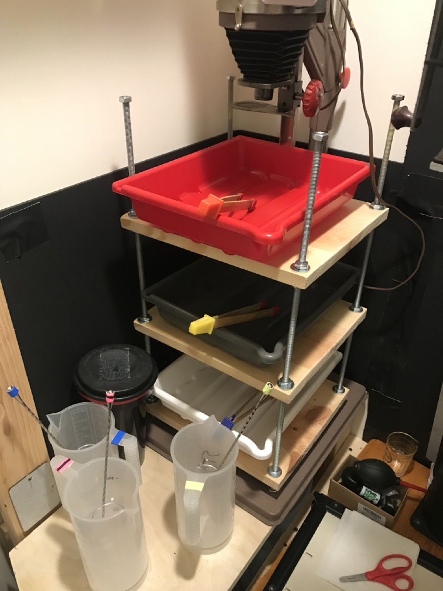
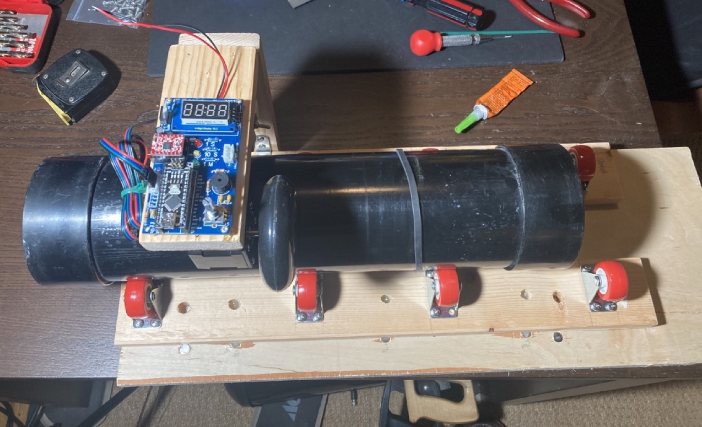
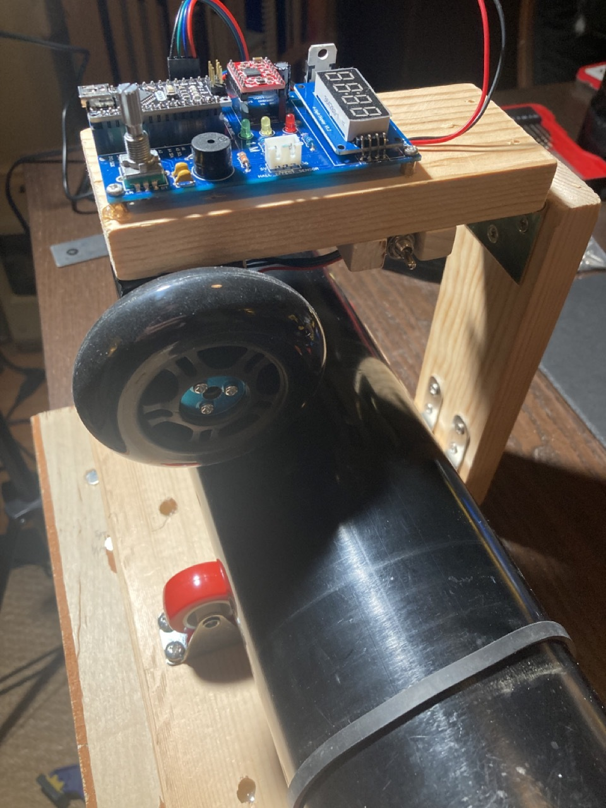
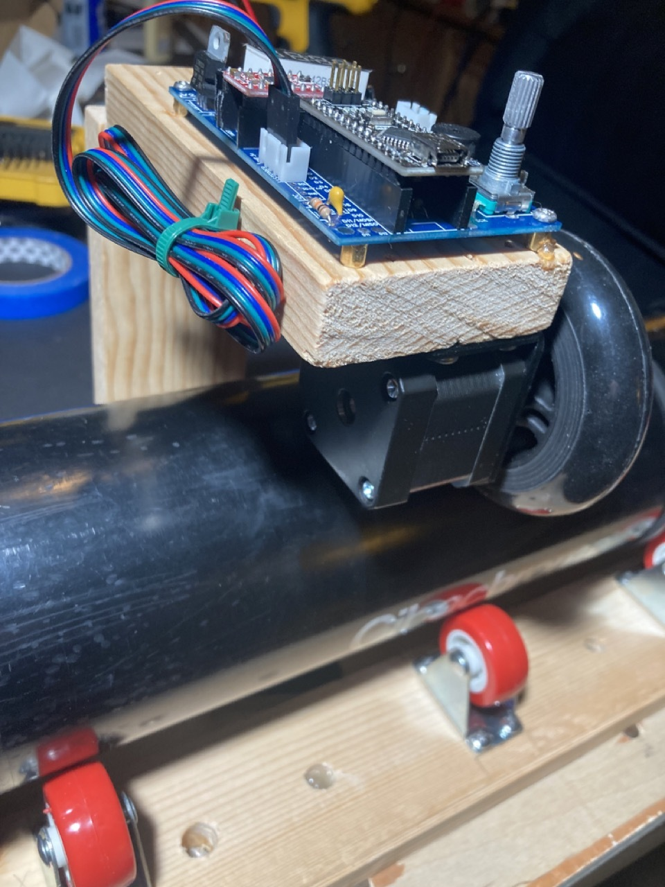
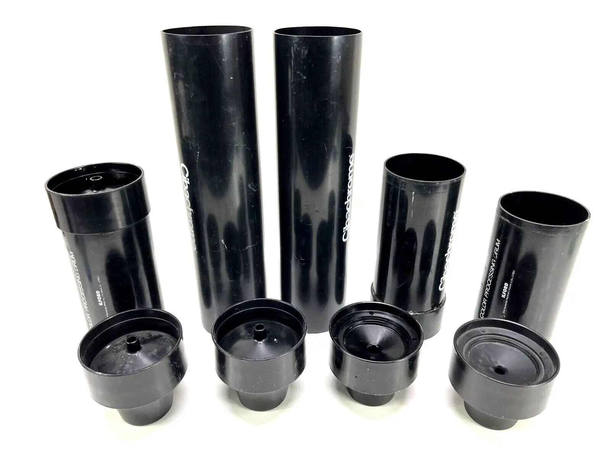
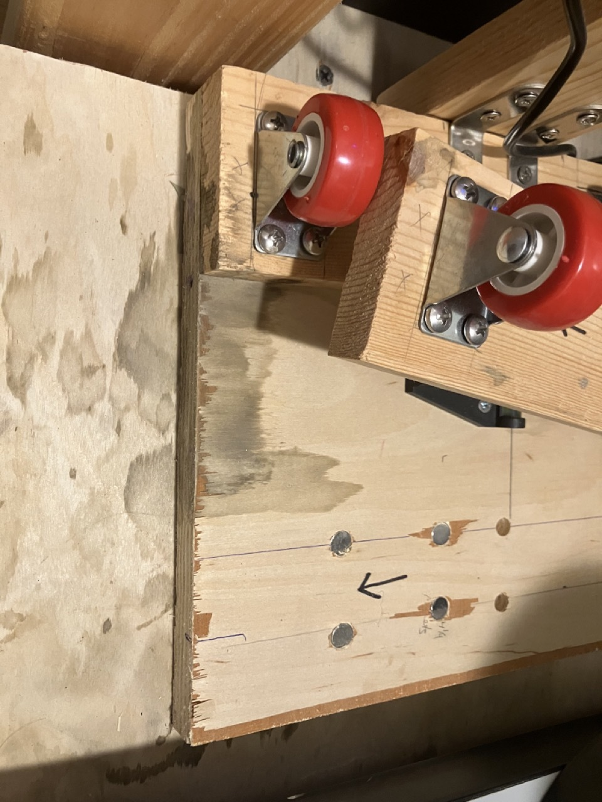
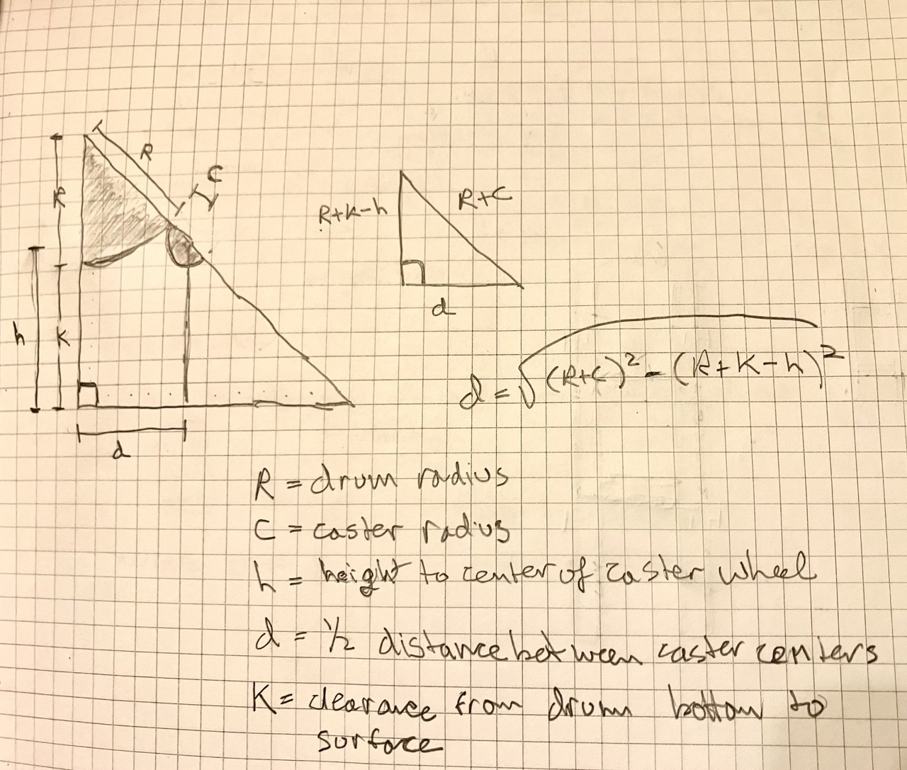
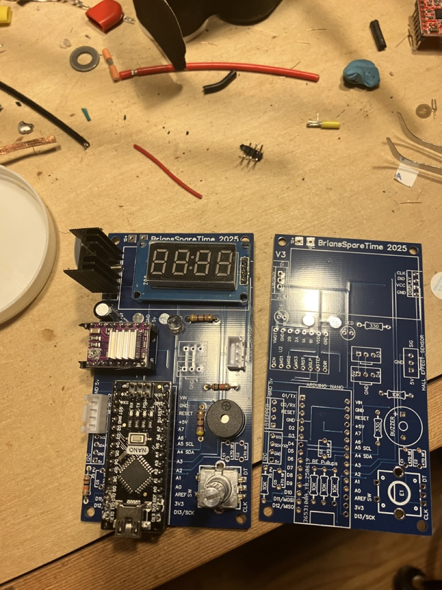

When I upgraded my enlarger from an Omega D II to a LPL 7450, I lost some of the space where my developing trays had been.

I was already unhappy with the trays - you need three, and the only way to fit them was as a stack.

But if I wanted to change formats, I needed not only another set of 3 trays, but another tray-stacking-shelf.  Changing print formats quickly was impossible, and storing the extra stacks and trays is a pain.

While it is magical to see a print materialize in a tray for the first time, after that, this magic diminishes sharply:  the physical discomfort of having to smell fixer, followed by the intellectual discomfort that the fixer has damaged your brain sufficiently that you no longer smell it.

So instead of developing photographic prints in a series of trays for each chemical process, a 
rotary or drum processor uses a single light-tight drum for all processes.  This saves space,
especially as the print size scales, uses less chemistry, and preserves that chemistry for
longer (since it's not sitting open to the air).  And importantly, you're not smelling a tray of fixer.

But if you're doing rotary processing in a drum, it's nice to have a rotary processor better than your hands.

This processor is open source, easy to assemble, and easy to use.  

All electronics sit on the top, so the base of the processor can easily be 
submerged in a tub and used with an independent sous-vide heater for temperature controlled 
color processing/developing.  

Although I use it for darkroom prints, there's no reason it could not also be used for film development as well.

A stepper motor and rollerblade wheel drive the drum from above, on a hinged arm.  Speed is about 
60-75 rpm.  A tilt switch automatically detects drum size (4" or 6"), and adjusts rotation speed to 
match.  Different drum sizes and rotation speeds easily configurable in code.  Rotation direction reverses
periodically, and at a different, random point in rotation each time to ensure even time in the chems.

The entire project can be assembled on a low budget (< $100), and probably a lot less if you 
have any of this stuff lying around.

I've been using Ilford Cibachrome drums, but the more expensive Jobo drums work too.

## Usage:

- Turn processor on with on/off switch
- Short press on the rotary encoder moves between setting digits of the timer (1x seconds, 10x
seconds, 1x minutes).
- Rotating the encoder changes the value of the selected digit
- Long press starts the rotary cycle
- Any control input while running causes it to stop.

<video controls width="406" src="roller.mp4">
Your browser does not support the video tag.
</video>

## Hardware (non-electronic):

- [1.5 inch casters](https://www.amazon.com/gp/product/B09V74CMRQ/ref=ppx_yo_dt_b_search_asin_title?ie=UTF8&psc=1) mounted to a base board.

### Caster Spacing (and space underneath the drum)

You need the casters close together enough that the drum doesn't bottom out, yet far enough apart to be stable.  

If you're expecting to submerge this in water, you want enough water height to maintain temperature stability, but not so much that raising and lowering its temperature is time consuming.

And if you want to use different sized drums, you may want to make the spacing between your casters variable.  I did this by mounting the casters on 3/4 plywood rails, which can fit onto one of two rows of magnets/pegs on the base board.  

More generally, if we label our measurements:

- R is your drum radius (2" for the smaller 4" Ilford drums, 3" for the larger 6" Ilford or Jobo drums)
- c is your caster radius (3/4" here)
- h is the height of the caster from caster base to the center of the axle of the wheel (on my caster, about 1 1/8")
- d is half the distance between the casters
- k is the clearance between the bottom-most point of your drum and the caster's base plane

You can solve for d (half distance between casters) as d = sqrt ( (R+c)^2 - (R+k-h)^2 ).  

Not being concerned with submersion for now, I set k=0 so the only bottom clearance was the height of rails.  I spaced the casters about 5 1/4 inches (center to center) for 8x10 and 11x14 Ilford drums, and for the 16x20 Ilford drum or the Jobo drums, 6 1/2 inches.  

You could of course stop here and just rotate the drum by hand, but what fun is that?

## Additional Hardware (for electronic operation):

- [Nema 17 motor mount](https://www.pololu.com/product/2266)
- [84x24mm roller blade wheel](https://www.pololu.com/product/3275)
- [Scooter wheel hub adapter](https://www.pololu.com/product/2673)
- basic cabinet hinge

## Electronics:

The heart of the project is an old-school 5v Arduino Nano (the old one with old usb-mini plugs).

Connected to the Arduino via the custom pcb are:

- TM1637 4 digit 7 segment display
- KY-040 rotary encoder
- A4988 (or DRV8825) stepper driver
- Nema 17 stepper motor
- LM7805 voltage regulator
- one 470 uF filtering cap for the stepper driver
- three 10k resistors for the rotary encoder

### Optional components:  

These aren't required, but exist on the PCB and are supported in code:

- LED (and 330 ohm resistor), which blinks on completion
- piezo beeper (and 330 ohm resistor), which beeps on completion
- tilt sensor for detecting two different drum sizes
- (4) 470nF capacitors, originally to help with debounce, although software debounce is now pretty good and these aren't needed

Not supported in code, but available on the PCB for future use or extension:

- header for i2c (and 10k resistor), available for additional sensors and/or future expansion
- 2 extra 3-pin header for D3 and D4 (each with vcc and ground pins), available for additional sensors and/or future expansion

All soldering is through-hole, and can be done with a simple soldering iron in about 15-20 minutes.

### Power Supply:

The voltage regulator should work fine with power supplies in the 9-12v range, BUT the supply should also have sufficient amperage to run the stepper!  

**I'm using a 12 volt 4 amp supply - I would NOT recommend using less, or you may have issues with motor unevenness.**

Rather than mess around with connector sizes and polarity, just cut the end off your power cord and 
solder it onto the PCB.  Check polarity with a multimeter.

## Software

Code is based on my [PlantWaterBot](https://github.com/brianssparetime/PlantWaterBot), using a state machine and separate files for each
sensor/device to keep things organized, understandable, and extendable.

## Build your own?

Building the basic hardware is very straight forward, and really only requires a drill and screw driver.

Assembling the electronics only requires a soldering iron.

Download the code, compile, and upload to the Arduino, and you are in business.

Code, PCB gerbers, and build details on [github](https://github.com/brianssparetime/darkroom_roller).
