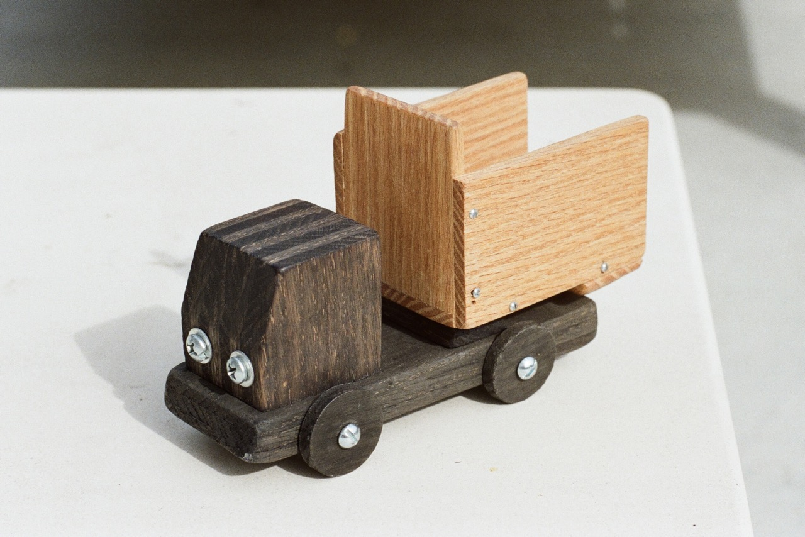
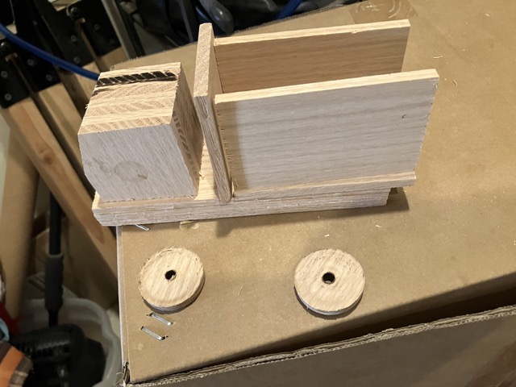
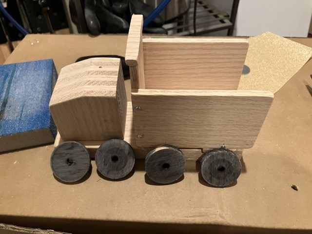
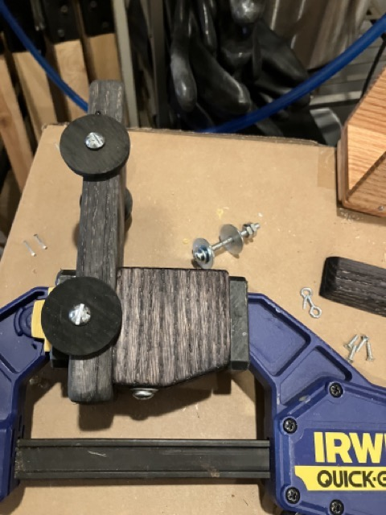
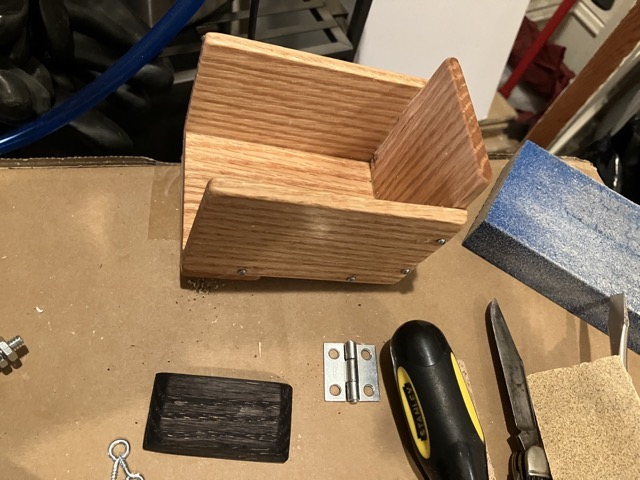
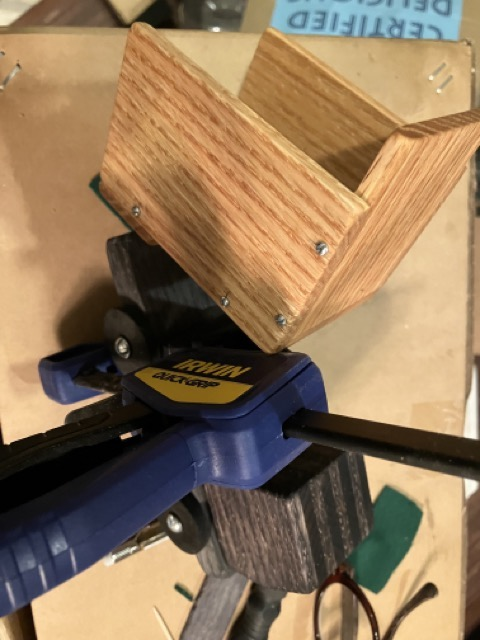
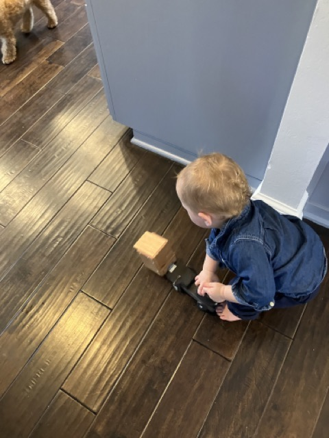

I made a toy dump truck from quarter-inch oak slats.

The chassis consists of 3 slats and the cab a stack of 8, laminated before cutting.

The light stain is just food-grade mineral oil.

The dark stain is a half-day reduction of gourmet coffee with a bottle of 10 year old Martini Rossi.

Satisfied customer
