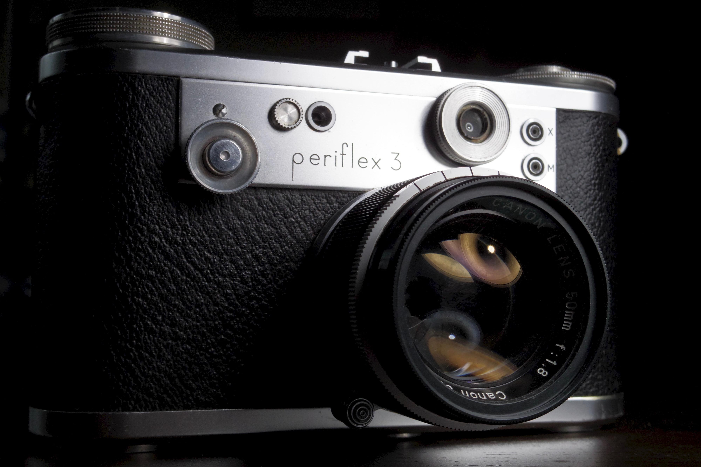

The Corfield Periflex 3 is an odd camera, to say the least.  I like to think of it as an alternative future direction of evolution from the Leica Barnack design.

It's a SLR that uses LTM lenses (and not just the mount, but the flange distance too!).  Where's the prism?  Doesn't have one.  Where's the mirror box?  Doesn't have one.  How is it an SLR then?  When you advance the film, not only does it cock the shutter, but it also lowers a little periscope down between the film plane and the lens.  

On the back, you have two windows Leica style.  The first is just a viewfinder with frame lines (though interchangeable for different focal length lenses!), and the second window, instead of having a rangefinder, looks through the periscope, showing you a close up of the center of the composition to assist with critical focus.

I think this is a really creative solution to some of the shortcomings of the traditional rangefinder:  

- It avoids the 1m close focus distance of most rangefinders, allowing you do even do macro.  Corfield even made LTM extension tubes for this.

- Parallax is much less an issue, since you can see directly where your frame is centered.

- Long lenses (or weird lenses) can be more accurately focused TTL

But it retains the small size of a rangefinder, is compatible with basically any LTM lens (there are some interesting shots out there using this with the Industar 69 off a Chaika).  I mentioned the viewfinders are interchangeable - the front part just screws off and can be replaced - the frame lines are built into the back part that stays fixed.  This is a very cool idea I wish others had adopted.

I do have one issue with mine though...

When I look through the viewfinder (with frame lines, not the periscope), I see two partially overlapping images, one anchored to the left and one to the right, where the boundary between them jumps depending on where my eye is.  I tried to capture it [here](https://imgur.com/a/lCRVR80), where you can see the light jumping back and forth in the center of the viewfinder.  This is seriously annoying, and headache inducing.  Given the simple construction of the window, I'm not sure what could be causing it.  Curious if anyone has suggestions for how to further diagnose or fix.

A big thanks to [/u/ConstrictorLiquor](https://old.reddit.com/u/ConstrictorLiquor), whose [review](https://mikeeckman.com/2022/02/corfield-periflex-3-1957/) got me interested enough to spend a year looking for one.

Interestingly, like Mike Eckman's copy, the film reminder window (the third window on the back, and the "fake" rangefinder window on the front) doesn't seem to work right.  Perhaps that was poorly made.  The manager who approved that feature should have been fired anyways, since it involves a whole lot of parts for something that could have been basically a sticker on the wind knob.  Not to mention it's basically impossible to adjust the knob on the front without blocking the window.

