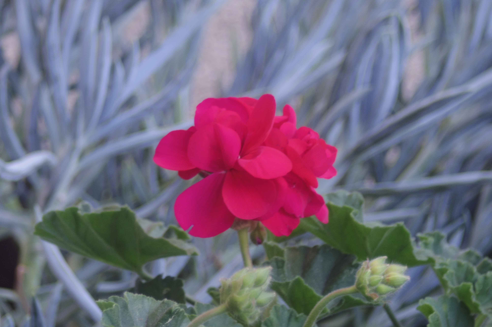
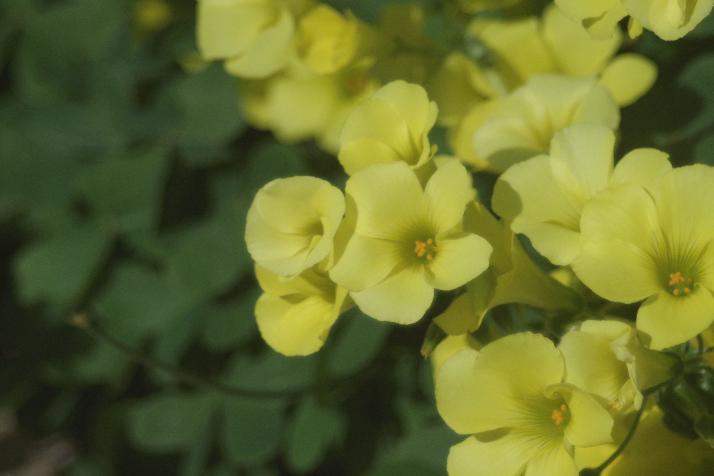

The [Pentax Q](/posts/pentax-q-review) is the camera I wish I'd bought ten year ago.

Some pictures taken with the Pentax Q lenses, the softer ones taken with vintage 8mm film lenses that can be acquired for ~ $10 on ebay.

