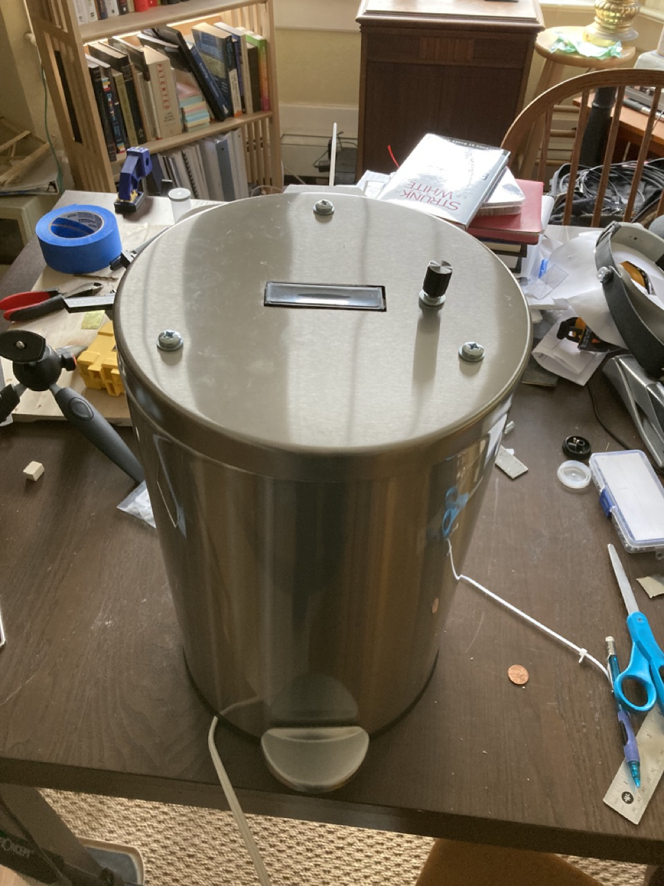
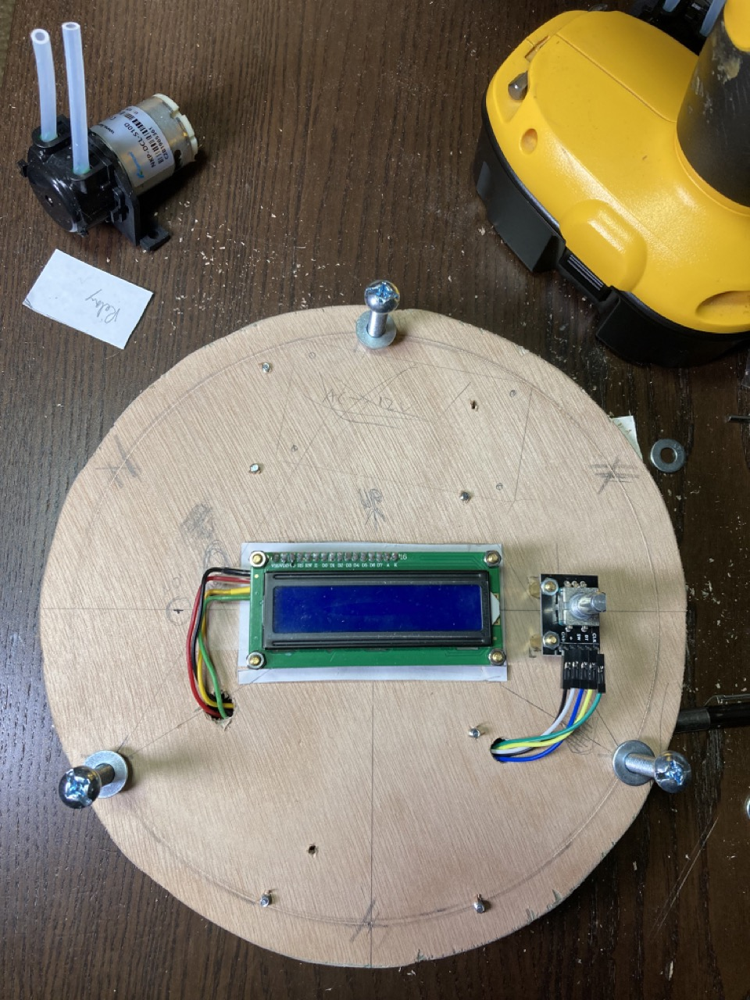
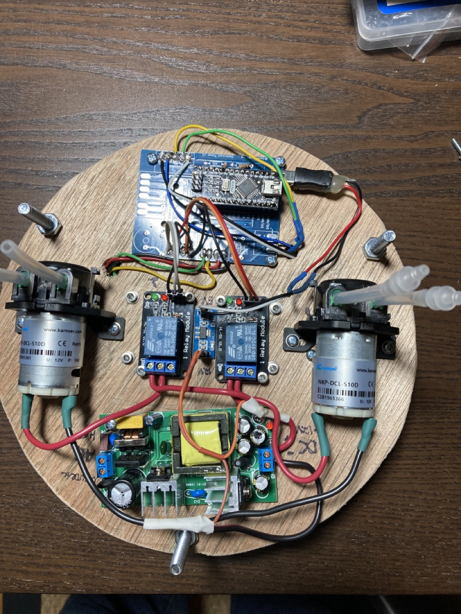
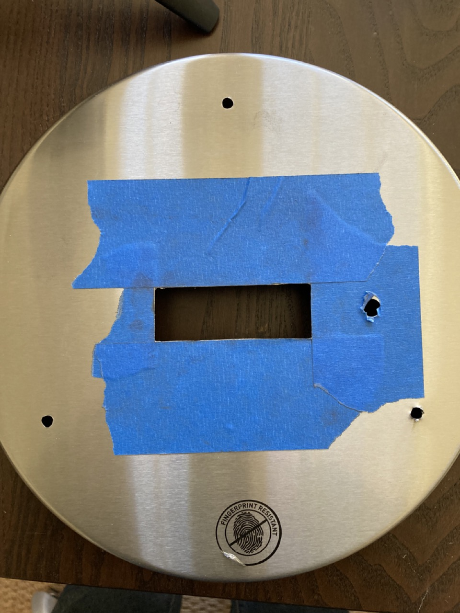
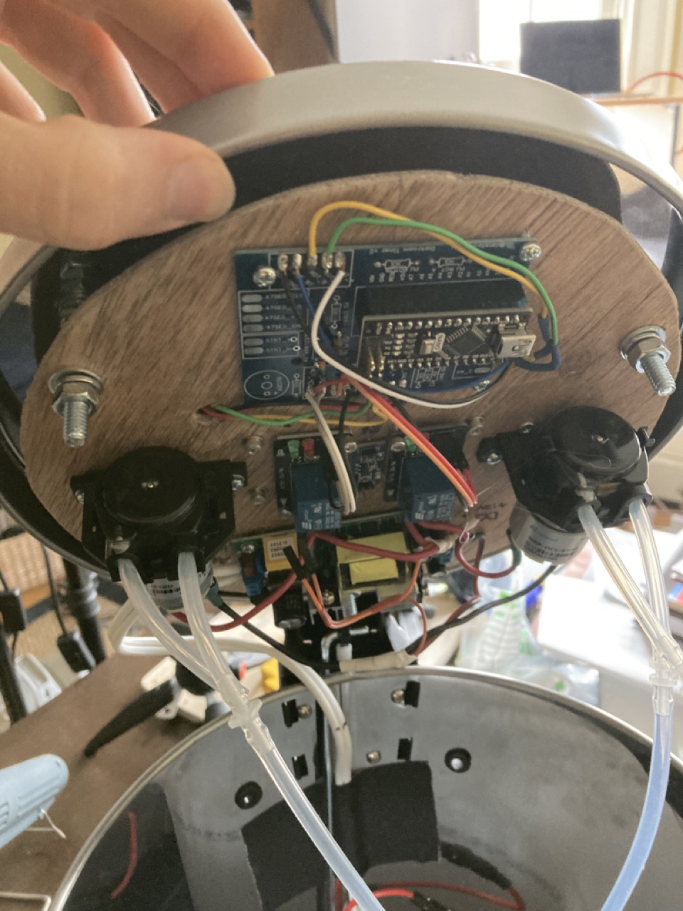

My friend asked me to care for his plants while he was out of town.

I did my best, and so did the plants, but it wasn't fun for either of us.  I wasn't meant to be a farmer.

I'm much better at making things though, so I decided to build a plant watering robot.

My friend has a strong aesthetic sense, a preference for minimalism, stainless steel, and glass.  

Wires and tubes everywhere would be unacceptable.  So rather than build my own enclosure, I found the perfect one - a simple and elegant cylinder, gleaming stainless steel, that even had a raisable lid built in.  Only the screen and knob (and 3 bolts in a geometric triangular shape) would mar the exterior surface.

Steve Jobs would be proud.

Except that it was a trash can.

## The Electronics

To save time and effort, I re-used the PCB from the [darkroom timer](/posts/darkroom-timer-build) I previously built - it 
already had a LCD display and rotary encoder UI, and pads to control two relays.  The relays would just be controlling pumps, not an enlarger's bulb and fan.

This was straightforward.

The challenge was the remaining two items: the firmware, and the physical enclosure.  

On both, I wanted to improve specific problems I had with the darkroom timer.

## The Firmware

The code for the darkroom timer is a hideous mess I'm ashamed to have written - one big long spaghetti noodle.

There are deeply nested if statements, and code for particular states is scattered across teh file.  Keeping track of timers and not blocking was even more confusing.

For the water bot, I cut the noodle into one object per hardware unit, one object per UI screen.

Each sensor, output, or subsystem gets its own file and object.  That object provides an initial setup function, and an update function (that gets called in the loop).  Thus all code related to a particular function lives in the same place.

UI states work the same way, each providing an init, update, and their own handling of any inputs.

Each update routine holds and checks its own timers independently without blocking (no delay() calls, only checking whether millis() is >= some interval plus a stored start time from millis() earlier, and some counters rolling minutes to hours).

The running state's update code handles state transitions by checking inputs and calling the new state (e.g. the inactive state checks for a button press to change to the active state, which checks for a button press to select a menu item...).

This modular state machine approach keeps all related code together, keeps the organization simple and reusable, and is infinitely better for an Arduino project.

A barebones example of this setup is [here](https://github.com/brianssparetime/UI_FSM_example).

[Source code is here on github](https://github.com/brianssparetime/PlantWaterBot)

## The Hardware

The darkroom timer was a box with a lid, and the display was mounted to the lid directly.  This was a huge pain - it was hard to get the alignment of the window and the screw holes perfect, not to mention you have screws showing on th lid around the window.

So for this, I decided that I would mount all the electronics to a wooden back-plane, which was suspended below the metal lid on bolts.  This backplane would hold the display and rotary encoder so they would protrude up through the window/hole, but not be directly mounted to the lid.

The bottom of the backplane holds the main PCB, the power board, the relays, and the pumps.

This allows all the electronics to be easily removed as a single unit - just undo the 3 nuts on the backplane bolts, and take the knob/retaining ring off the rotary encoder.  

The water jug sits inside the trash can, and I added holes and rubber grommets to the back for the exit hoses.

