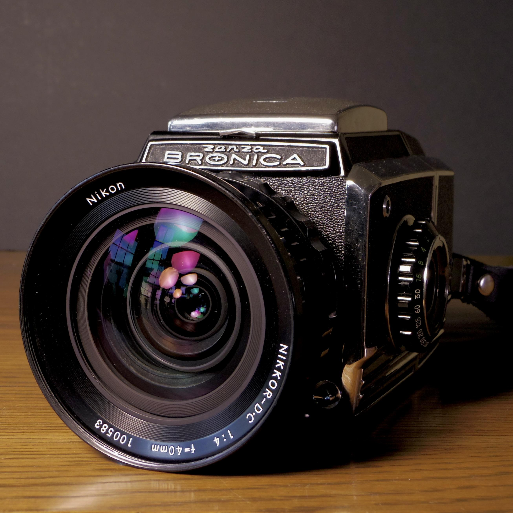
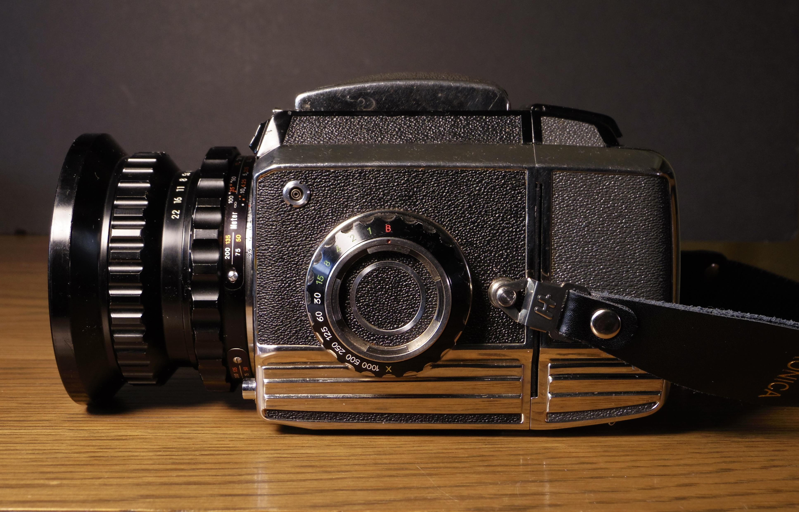
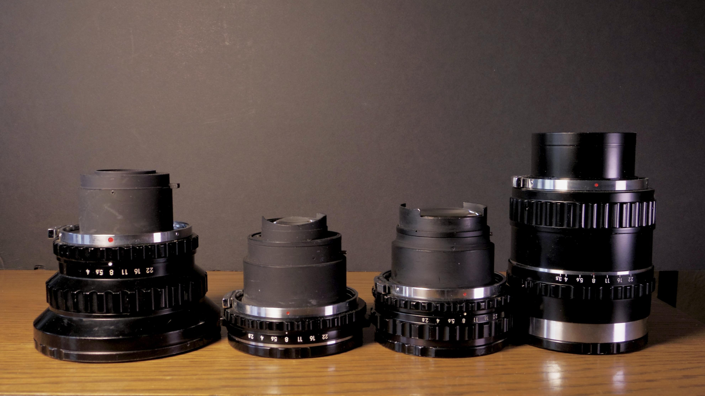
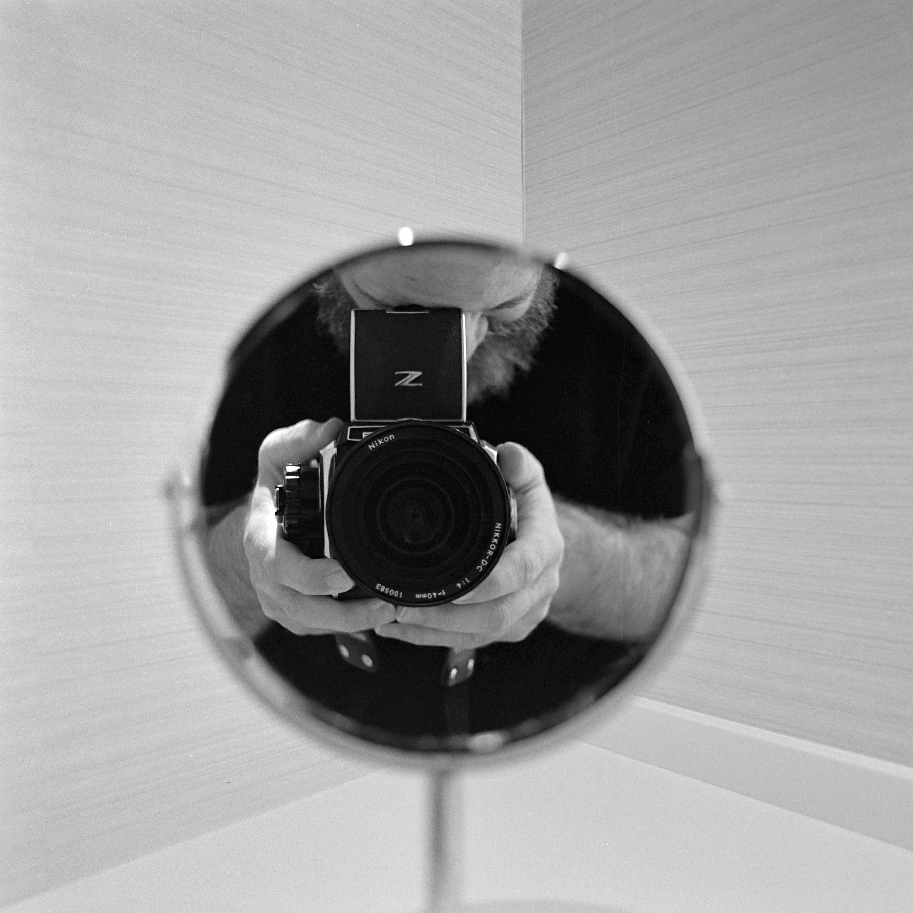

Have you ever looked at the Hasselblad SWC and thought to yourself:  I love this, but it just looks flimsy and insubstantial.  And it's not even a real SLR?  I need to see what I'm shooting and still have two functional kidneys in my body...  

I need my superwide, but chunky and on the cheap.

While your mom fits those criteria, we're talking today about the Nikkor DC 40mm f4 - my favorite lens from the Bronica S2/EC system.  Having looked at one of the [longest focal lens for the system](https://www.reddit.com/r/AnalogCommunity/comments/1h1fw50/bronica_s2a_telephoto_madness_the_komura_500mm_f7/), I thought I'd now look at the shortest.

On the used market, a Bronica body costs only 10-20% of what a Hasselblad goes for.

The 40mm lens costs about as much as a working Bronica body of lesser condition.  I got my lens for about half its usual price because it had a fungus spot, which a UVC lamp and some cleaning soon extirpated.  Note the Nikkor 40mm comes in D and DC versions: the DC is just a newer multicoated version of the D.  Also note that there is second 40mm lens for the system, made by Bronica itself after its divorce from Nikon, and branded as a Zenzanon.  This one is also f/4, but is a pancake instead of foghorn, and unfortunately 2-3x the price of the Nikkor when it comes up.  I'd like to try it one day, but that's another story.

Compared to the SWC, the Bronica SWFF has a lens ever so slightly longer (40mm vs 38mm), but that's not enough to make much difference.  It's like a 25mm horizontal full frame equivalent field of view (versus 24mm on the SWC) and 17mm vertically (versus 16mm on the SWC).  Not that different.

On the other hand, while the SWC is svelte, lightweight, and compact, the SWFF is anything but.  The S2 itself aesthetically resembles peak 1950s America Detroit iron, and weighs as much.  And this lens is... big.  The filter size is 90mm.  It weights nearly a third as much as the body (512g with lens cap / 1710g with helicoid and back, no film, no strap).  Despite that, it extends only 50mm past the front of the focusing helicoid (at infinity, including the 5mm lens cap; compare with about 20mm past the focusing helicoid for the 75mm Nikkor P, also with lens cap at infinity).

The Nikkor-D is almost in the territory of lenses that mount a camera to them, rather than vice versa, but not quite.  I'd say it's more like a mating of co-equals.  When unmounted, its shape resembles a volcano, and it is particularly inconvenient to pack around.  Side note:  Bronica lens body-side end caps suck.  On nearly every Bronica cap I have, the thin lugs that engage with the bayonet mount have cracked or broken, so they don't really stay on well.  Bronica should have copied Komura's screw-on solution.  

The filter size is a beastly 90mm (though this is frequently misreported online as being 67, which is the standard for most Bronica lenses and for the Zenzanon 40mm pancake).

Low light performance is one thing I really like about this lens.  While f/4 is not generally considered "fast," the short focal length buys at least one usable stop over the standard 75mm f2.8, and the greater DOF is also super helpful in low light.  Personally, I've shot this lens hand held (with bracing) down to 1/8th with usable good results, and I frequently shoot it at 1/15th.  

Although it is not a macro, this lens also has a great minimum focusing distance.  Because most Bronica S2 lenses share the same helicoid, the travel of the helicoid is centered around the standard 75mm kit lens.   Wider lenses thus extend farther than they otherwise might and thus benefit from increased MFD, while longer lenses that use the same helicoid tend to have a little less MFD (relative to comparable lenses in other systems).  The Nikkor 40mm can focus down to less than a foot, or 27cm, which is quite close despite the wide field of view.  Combined with the SLR body (no need for parallax correction), this makes near-macro shots possible.

Overall, this lens has been my favorite for the system by a fairly wide margin - I've taken more photos with the Nikkor-D than with all the other lenses I have for the S2 combined.  Despite it's size, I've carried this thing through 10 different countries and it's unlike anything else I own in performance and field of view. 

[Here is a gallery of some of my photos taken with this lens on my S2 over the last year.](https://www.flickr.com/photos/brianssparetime/albums/72177720323020580/)  *(Please note that vignetting has been added to most of these photos in post).*

