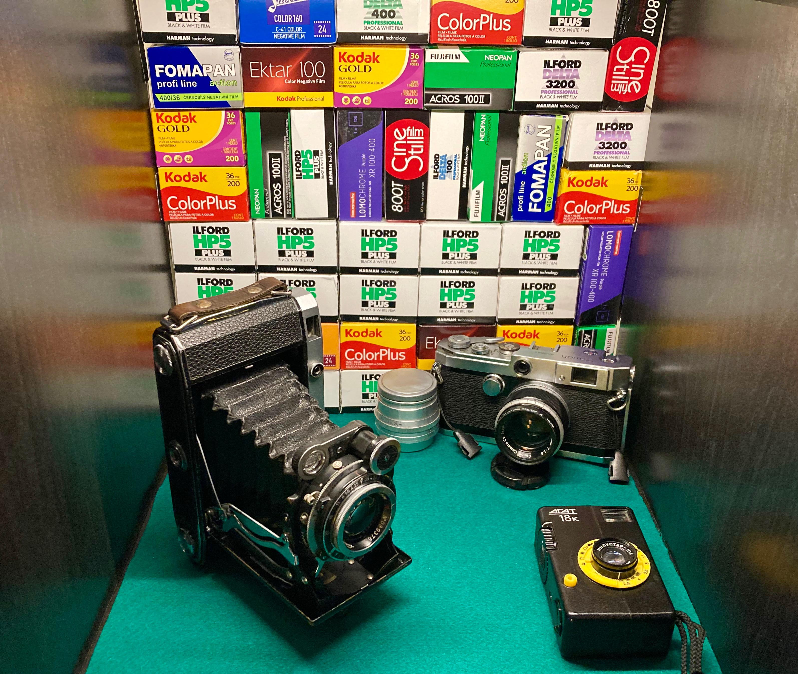

[/u/john177877](https://old.reddit.com/u/john177877)'s original post [here](https://www.reddit.com/r/AnalogCommunity/comments/rsemuh/one_year_of_doing_crack_i_mean_shooting_film/).  Film boxes fit very nicely within an IKEA Kallax shelf.

Been saving boxes since then. 

My two favorite film stocks are HP5 and ColorPlus 200, but after getting a good deal on some Acros II that's joined my favorite list too.  

Pictured are my [Moskva 5](https://www.flickr.com/photos/brianssparetime/albums/72177720295611696), [Canon V L1](https://www.flickr.com/photos/brianssparetime/albums/72177720297076667) with Canon 50mm f/1.8 attached and Jupiter 8, plus my [Agat18k](https://www.flickr.com/photos/brianssparetime/albums/72177720295600296). Together these three account for probably 80% of this film.

[/u/john177877](https://old.reddit.com/u/john177877)'s original post [here](https://www.reddit.com/r/AnalogCommunity/comments/rsemuh/one_year_of_doing_crack_i_mean_shooting_film/).  Film boxes fit very nicely within an IKEA Kallax shelf.

Been saving boxes since then. 

My two favorite film stocks are HP5 and ColorPlus 200, but after getting a good deal on some Acros II that's joined my favorite list too.  

Pictured are my [Moskva 5](https://www.flickr.com/photos/brianssparetime/albums/72177720295611696), [Canon V L1](https://www.flickr.com/photos/brianssparetime/albums/72177720297076667) with Canon 50mm f/1.8 attached and Jupiter 8, plus my [Agat18k](https://www.flickr.com/photos/brianssparetime/albums/72177720295600296). Together these three account for probably 80% of this film.

